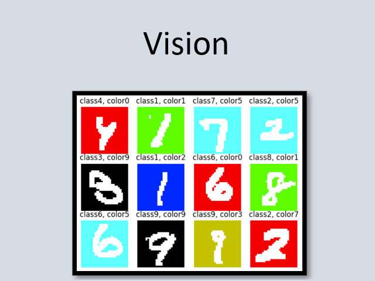

# FairBench


[](https://fairbench.readthedocs.io/)
[](https://github.com/psf/black)

A comprehensive AI fairness exploration framework.

**Author:** Emmanouil (Manios) Krasanakis <br>
**License:** Apache Software License 2

## Features

- :chart_with_upwards_trend: Fairness reports and stamps
- :flags: Multivalue multiattribute
- :hammer_and_wrench: Measure building blocks
- :gear: ML integration (`numpy`,`torch`,`tensorflow`,`jax`)

Learn more in the [documentation](https://fairbench.readthedocs.io/).

## Recipes

[](examples/demos/demo.ipynb)
[](examples/demos/graphs.ipynb)
[](examples/demos/vision.ipynb)

## Citation

```
@article{krasanakis2024standardizing,
      title={Towards Standardizing AI Bias Exploration}, 
      author={Emmanouil Krasanakis and Symeon Papadopoulos},
      year={2024},
      eprint={2405.19022},
      archivePrefix={arXiv},
      primaryClass={cs.LG}
}
```