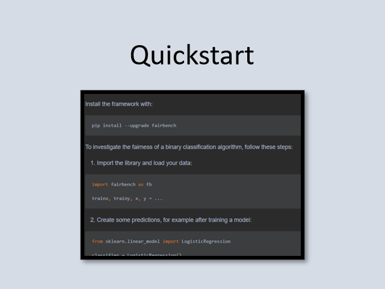
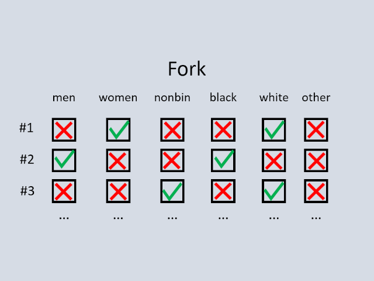

# FairBench

A comprehensive AI fairness exploration framework.

**Author:** Emmanouil (Manios) Krasanakis  
**License:** Apache Software License 2

## Features

- :chart_with_upwards_trend: Fairness reports
- :flags: Multivalue multiattribute
- :hammer_and_wrench: Measure building blocks
- :gear: ML integration (`numpy`,`torch`,`tensorflow`,`jax`)

## Get started 

Advanced topics

- [Available metrics](docs/metrics.md)
- [Add your own metrics](CONTRIBUTING.md)
- [Distributed execution](docs/distributed.md)

Usage on example data (notebooks)

Recipes

[Binary Classification](examples/recipes/classification_binary.ipynb)