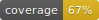
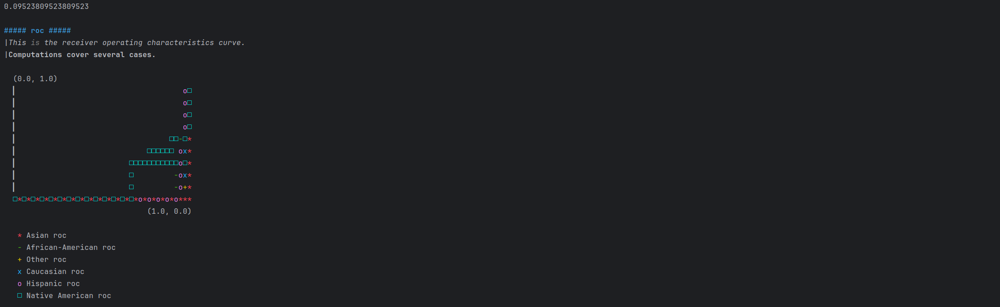
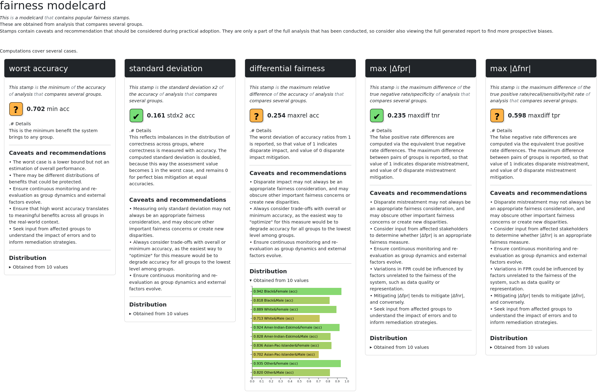

# FairBench

[](https://mammoth-eu.github.io/mammoth-commons/index.html)


[](https://fairbench.readthedocs.io/)
[](https://github.com/psf/black)
[](code_of_conduct.md) 

:mammoth: This software is part of MAI-BIAS; a low-code toolkit for
fairness analysis and mitigation, with an accompanying suite of coding
tools. Our ecosystem operates in multidimensional and multi-attribute 
settings (safeguarding multiple races, genders, etc), and across multiple 
data modalities (like tabular data, images, text, graphs). Learn more 
[here](https://mammoth-eu.github.io/mammoth-commons/index.html).

## Who is this for?

- **ML engineers and data scientists** building or evaluating models in Python.
- **Researchers** studying AI bias across data modalities (tabular, vision, LLMs, etc).
- **Bias auditors and compliance teams** needing standardized, traceable fairness reports, and system comparison across different datasets, parameters, and over time.
- **Policymakers and analysts** who want reproducible evidence for decision‑making. Consider using the low‑code MAI‑BIAS toolkit for a higher level perspective.

## About

FairBench can be imported in Python AI projects to
offer standardized exploration of more than 300 
fairness metrics. It also produces reports that organize
many of those metrics, and which can be viewed in various formats 
(e.g., in the terminal, in the browser) as part of ongoing 
reporting by developers, auditors, and eventually policymakers
with a certain degree of technical background.

Fairness exploration is not limited to one or a few measures at a time,
though single-measure computations are still available, in line with other
industrial frameworks. Instead, FairBench computations are traceable in that 
they let users explore intermediate quantities leading to problematic values. 
When reporting focuses on one metric that may miss the bigger picture, it is
accompanied by caveats and recommendations extracted through the help of 
social scientists. 

FairBench is independent of data modality and downstream task.
For example, it supports -among others- regression and multiclass outputs 
from most popular computational framework, and contains out-of-the-box
experiments for tabular, image, and graph data. 
It can also be used in uncovering LLM biases.

If you have some coding experience with Python stacks like
Pandas and NumPy, the library can be installed in your environment 
and called directly from your code. But it also
supports many fairness analysis functionalities
for immediate use by non-technical people in the low-code environment of the
[MAI-BIAS toolkit](https://mammoth-eu.github.io/mammoth-commons/index.html).

## :rocket: Highlights

🧱 Build measures from simpler blocks<br>
📈 Fairness reports and stamps <br>
⚖️ Multivalue multiattribute <br>
🧪 Backtrack,filter, and reorganize computations<br>
🖥️ ML and LLM compatible: *numpy,pandas,torch,tensorflow,jax,transformers,ollama*

*FairBench strives to be compatible with the latest Python release, 
but compatibility delays of third-party ML libraries usually 
mean that only the language's previous release is tested and
stable (currently 3.12).*

## Material

- [Documentation](https://fairbench.readthedocs.io/): quickstart, how to use FairBench, and test it in your browser
- [Discord](https://discord.gg/WwQWFSjSWZ)
- [Benchmarks](benchmarks/README.md)

## Quick measure

:mammoth: Non‑technical users can run the same 
analysis through the MAI‑BIAS toolkit without writing code.
See the higher-level toolkit summary in the first
example [here](https://mammoth-eu.github.io/mammoth-commons/examples.html).

```python
import fairbench as fb

x, y, yhat = fb.bench.tabular.compas(test_size=0.5, predict="probabilities")
sensitive = fb.Dimensions(fb.categories @ x["race"])

# more than 300 standardized measures generated by name and packed into a report
abroca = fb.quick.pairwise_maxbarea_auc(scores=yhat, labels=y, sensitive=sensitive)
print(abroca.float())
abroca.roc.show()
```



## Full report

:mammoth: Non‑technical users can run the same 
analysis through the MAI‑BIAS toolkit without writing code.
See the higher-level toolkit summary in the second
example [here](https://mammoth-eu.github.io/mammoth-commons/examples.html).


```python
import fairbench as fb

x, y, yhat = fb.bench.tabular.compas(test_size=0.5)

sensitive = fb.Dimensions(fb.categories @ x["sex"], fb.categories @ x["race"])
sensitive = sensitive.intersectional().strict()
report = fb.reports.pairwise(predictions=yhat, labels=y, sensitive=sensitive)
report.filter(fb.investigate.Stamps).show(env=fb.export.Html(horizontal=True), depth=1)
```



## Attributions

```
@inproceedings{krasanakis2024towards,
  title={Towards Standardizing AI Bias Exploration},
  author={Krasanakis, Emmanouil and Papadopoulos, Symeon},
  booktitle={Workshop on AI bias: Measurements, Mitigation, Explanation Strategies (AIMMES)},
  year={2024}
}
```

**Project:** [MAMMOth](https://mammoth-ai.eu/) <br>
**Maintainer:** Emmanouil (Manios) Krasanakis (maniospas@hotmail.com)<br>
**License:** Apache 2.0<br>
**Contributors:** Giannis Sarridis

This project includes modified code originally licensed under the MIT License:

- ReBias. (Copyright © 2020-present NAVER Corp)<br>
Modifications © 2024 Emmanouil Krasanakis.<br>
See [fairbench/bench/vision/datasets/mnist/](fairbench/bench/vision/datasets/mnist/) for details.

- rbo. (Copyright © 2019 Changyao Chen)<br>
Modifications © 2025 Emmanouil Krasanakis.<br>
See [fairbench/fallbacks/rbo.py](fairbench/fallbacks/rbo.py) for details.
