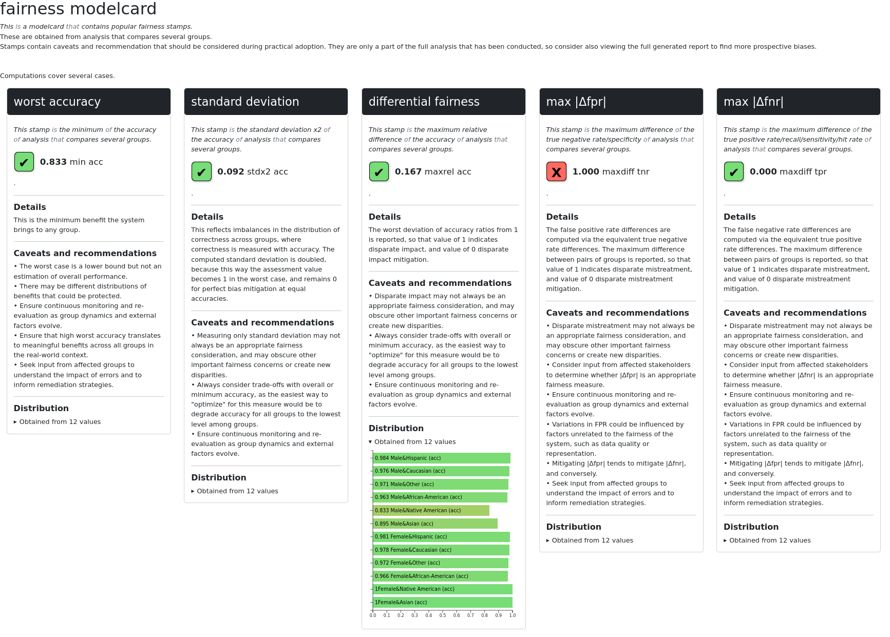

# FairBench


[](https://fairbench.readthedocs.io/)
[](https://github.com/psf/black)
[](code_of_conduct.md) 

A comprehensive AI fairness exploration framework. <br>
📈 Fairness reports and stamps <br>
⚖️ Multivalue multiattribute <br>
🧪 Backtrack computations to measure building blocks <br>
🖥️ ML compatible: *numpy,pandas,torch,tensorflow,jax*

*FairBench strives to be compatible with the latest Python release, 
but compatibility delays of third-party ML libraries usually 
mean that only the language's previous release is tested and
stable (currently 3.12).*

## Example

```python
import fairbench as fb

x, y, yhat = fb.bench.tabular.compas(test_size=0.5)

sensitive = fb.Dimensions(fb.categories @ x["sex"], fb.categories @ x["race"])
sensitive = sensitive.intersectional().strict()
report = fb.reports.pairwise(predictions=yhat, labels=y, sensitive=sensitive)
report.filter(fb.investigate.Stamps).show(env=fb.export.Html(horizontal=True), depth=1)
```



## [Documentation](https://fairbench.readthedocs.io/)

## [Benchmarks](benchmarks/README.md)

## Attributions

```
@article{krasanakis2024standardizing,
      title={Towards Standardizing AI Bias Exploration}, 
      author={Emmanouil Krasanakis and Symeon Papadopoulos},
      year={2024},
      eprint={2405.19022},
      archivePrefix={arXiv},
      primaryClass={cs.LG}
}
```

**Project:** [MAMMOth](https://mammoth-ai.eu/) (https://mammoth-ai.eu) <br>
**Maintainer:** Emmanouil (Manios) Krasanakis (maniospas@hotmail.com)<br>
**License:** Apache 2.0<br>
**Contributors:** Giannis Sarridis

This project includes modified code originally licensed under the MIT License:

- ReBias. (Copyright © 2020-present NAVER Corp)<br>
Modifications © 2024 Emmanouil Krasanakis.<br>
See [fairbench/bench/vision/datasets/mnist/](fairbench/bench/vision/datasets/mnist/) for details.
