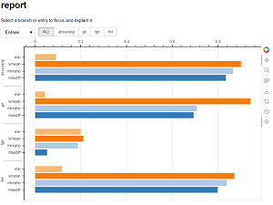
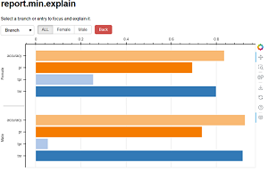

# Explore reports

Interactive visualization explores
complex objects generated with  `FairBench`, such as
comparison of report value explanations,
or of different algorithms. This is done with a user interface
that lets you navigate between various perspectives (see below).
The same exploration can be performed programmatically.

## Perspectives

To delve into complicated comparisons between
subgroups, you need to understand the concept 
of report perspectives. Viewing all values stored in a branch
is one perspective (e.g., `report.min` to view 
assessments for the worst metric values for that
branch).
But you can also obtain other perspectives, like viewing
all values for the same entry in all branches
(e.g., `report.tpr` to view true positive
rates across all branches).
Perspectives are equivalent to a combination of 
tensor access alongside a specific dimension.

### Code-based exploration

!!! info 
    This paragraph is under construction.

### Branch explanations

!!! info 
    This paragraph is under construction.


## Explainable values

Some report values can be explained 
in terms of data they are derived from.
For instance, if a `fairbench.isecreport` is made, both
empirical and bayesian evaluations arise from the underlying
data branches of multi-attribute fairness forks. More 
on exploration based on explainable objects can be found in
our introduction to programmatic [interactive exporation](interactive.md)

Whenever possible, the data branches that are converted
into final reports are preserved by having report values
be instances of the `Explainable` class.
This provides an `.explain` field of data contributing
to the report value, and `.desc` field to store additional 
descriptions. You can perform arithmetic operations
between explainable objects and other numbers and the
outcome will be normal python numbers.

<button onclick="toggleCode('explain')" class="toggle-button">>></button>
As an example, you can use these fields
to retrieve posterior estimations contributing to
calculating the *baysian* branch of the minprule
metric in the *isecreport*. 


<div id="explain" class="code-block" style="display:none;">

```python
report = fb.isecreport(vals)
fb.describe(report)
fb.describe(report.bayesian.minprule.explain)
```

```
Metric          empirical       bayesian       
minprule        0.857           0.853          

Metric          case1           case2           case2,case1    
                0.729           0.706           0.827     
```

</div>


### Algorithm comparison

To compare the same type of reports produced by two different
algorithms, you need to create a fork with the reports as its
branches. In the example below, we use 
[pygrank](https://github.com/MKLab-ITI/pygrank)
to run a normal pagerank algorithm and a fairness-aware adaptation
for node recommendation. Any number of algorithms can be assessed with
a FairBench reporting mechanism and combined into a fork. In this case,
the mechanism of choice is the multireport, used with
arguments needed to assess recommendation outcomes. At the end,
a fork is created and, although it can be too complicated to 
show in one figure or table,
you can obtain any perspective and visualize that. 
For example, the snippet below prints a table in the console
that compares algorithms in terms of various base auc measure
reductions.


```python
import pygrank as pg
import fairbench as fb

"""load data and set sensitive attribute"""
_, graph, communities = next(pg.load_datasets_multiple_communities(["highschool"]))
train, test = pg.split(pg.to_signal(graph, communities[0]), 0.5)
sensitive_signal = pg.to_signal(graph, communities[1])
labels = test.filter(exclude=train)
sensitive = fb.Fork(gender=fb.categories@sensitive_signal.filter(exclude=train))

"""create report for pagerank"""
algorithm = pg.PageRank(alpha=0.85)
scores = algorithm(train).filter(exclude=train)
report = fb.multireport(labels=labels, scores=scores, sensitive=sensitive)

"""create report for locally fair pagerank"""
fair_algorithm = pg.LFPR(alpha=0.85, redistributor="original")
fair_scores = fair_algorithm(train, sensitive=sensitive_signal).filter(exclude=train)
fair_report = fb.multireport(labels=labels, scores=fair_scores, sensitive=sensitive)

"""combine both reports into one and get the auc perspective"""
fork = fb.Fork(ppr=report, lfpr=fair_report)
fb.describe(fork.auc)
```

```
Metric          ppr             lfpr           
min             0.680           0.589          
wmean           0.780           0.743          
minratio        0.792           0.681          
maxdiff         0.178           0.276          
maxbarea        0.169           0.262          
```


## Interactive visualization

To start interactive visualization, call the snippet below
on an object that is a dictionary or fork. 
The call shows the default values for 
optional arguments, which set a report name to be displayed
and whether plots should be horizontally or vertically aligned.
Horizontal alignment lets figures remain
comprehensive during complex intersectional analysis.

```python
import fairbench as fb

obj = ...  # the object to explore (e.g., a  report)
fb.interactive(obj, name="report", horizontal=True)
```

When run in a console, the above code will start a bokeh server
that hosts a dynamic web page and will open the latter
as a tab in your local browser (hard-terminate
the process with ctrl+C to stop the server). When run in a 
Jupyter environment, a bokeh application will
start on the next output cell instead.

!!! info 
    When Jupyter runs on its non-default port,
    add a respective argument (e.g., `port=8889`)
    to interactive visualization to set appropriate permissions.


Interactive visualization starts from the top level of 
forks/reports and looks like the figures below. Figures
will appear only if data objects can be visualized. 
The first menu option over the figure controls whether 
to explore data by branches or entries. In the example
below, this means by reduction strategy over subgroups 
or performance metric.




You can focus on a specific branch or entry by clicking on its name 
on buttons over the figure. This will generate the appropriate perspective,
as shown below. Two new options are added: a button to go back to the 
previous perspective and an button to create an explanation perspective.
This last button appears only when you focus on specific branches or entries.
The current perspective always appears on the top. Currently, we are investigating
the minimum reduction strategy of the report. Hover over a bar to view its
exact values.


Let us now view the explanations of what quantities have led to 
computing the values of the current figure by clicking on the explain button.
The report we are exploring (multireport) 
performs reduction on the outcome of performance metrics on each
sensitive attribute branch, i.e., sensitive attribute dimension.
Thus, explanations consist of metric outcomes. Similarly to before, 
you can switch between showing branches and entries of explanation
values.





!!! tip 
    FairBench keeps track of metadata when computing base performance 
    metrics, and you can eventually view them and compare them 
    from within interactive visualization as explanations. For example,
    below is the explanation for ''true positive rates of the minimum
    reduction's explanation'', as indicated by reading the perspective's 
    title `report.min.explain.tpr.explain` from end to start.
    By looking at base metric explanations, you can get a feel
    for raw data properties and corresponding systemic, societal,
    or data gathering issues
    that eventually give rise to bias.<br><br>
    
