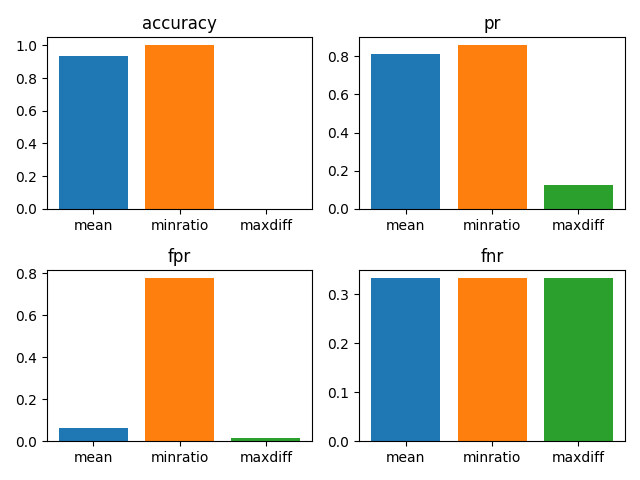

# Reports

Reports perform multi-faceted analyses of system outcomes
(e.g., predictions, recommendations, regression scores)
and produce explainable high-level views of biases found
across several definitions of fairness. For interpretation
of what report outcomes mean, 
look at the <sub><sup>REPORT ENTRIES</sup></sub> section.

1. [Generate reports](#generate-reports)
2. [Report types](#report-types)
3. [Show reports](#show-reports)
4. [Explainable values](#explainable-values)

!!! tip
    To check for some well-known fairness metric, 
    produce reports with
    relevant information (e.g., multireports shown below)
    and extract the metric with its [stamp](modelcards.md#stamps).

## Generate reports

You can generate fairness reports by providing some
of the optional arguments below to a report
generation method. These arguments are needed to automatically
understand which base
performance [metrics](../advanced/metrics.md) to compute.
Report generation method will try to compute fairness
assessment built from as many base metrics as they can,
depending on which arguments are provided.
You can also provide an optional `metrics`
argument that holds either 
a dictionary mapping names to metrics
or a list of metrics, where
in the last case their names are automatically inferred.
Sensitive attributes are [forks](forks.md)
to handle multi-value attributes or multiple
sensitive attribute values. 

| Argument    | Role                | Values                                                         |
|-------------|---------------------|----------------------------------------------------------------|
| predictions | system output       | binary array                                                   |
| scores      | system output       | array with elements in [0,1]                                   |
| targets     | prediction target   | array with elements in [0,1]                                   |      
| labels      | prediction target   | binary array                                                   | 
| sensitive   | sensitive attribute | fork of arrays with elements in [0,1] (either binary or fuzzy) |

!!! info
    In multiclass settings, 
    perform a different fairness assessment for each
    for class label. See [here](../advanced/multiclass.md).

## Report types

Out-of-the box, you can use one of the following
report generation methods:

| Report      | Description                                                                                   | Best for                                                                     |
|-------------|-----------------------------------------------------------------------------------------------|------------------------------------------------------------------------------|
| accreport   | Provides popular performance evaluation measures to be viewed between branches.               | Just metrics: accuracy, positives, true positive rates, true negative rates. |
| binreport   | Conducts a suite of popular binary fairness assessments on each variable branch.               | Branches that do *not* correspond to sensitive attributes.                   |
| multireport | Ideal for multi-fairness approaches, where the `sensitive` fork has many branches.             | Multidimensional analysis                                                    |
| unireport   | Similar to `multireport`, but each group or subgroup is compared to the whole population.      | Group-vs-population comparisons.                                             |
| isecreport  | Tackles multi-fairness with many intersectional groups.                                        | Bayesian analysis for small intersections.                                   |

As an example, let's create a simple report
based on binary predictions, binary
ideal predictions and multiclass
sensitive attribute `sensitive`, which is
declared to be a fork with two branches
*men,women*, each of which is a binary
feature value per:

```python
import fairbench as fb

sensitive = fb.Fork(men=[1, 1, 0, 0, 0], women=[0, 0, 1, 1, 1])
report = fb.multireport(predictions=[1, 0, 1, 0, 0], 
                        labels=[1, 0, 0, 1, 0], 
                        sensitive=sensitive)
```


## Show reports

Report are forks whose branches hold dictionaries of
metric computations. In some reports (e.g., multireport)
[reduction](../advanced/manipulation.md)
operations introduce a comparative analysis
between the sensitive attribute branches to investigate
unfairness. For example, `min` shows the worst evaluation
across sensitive groups, 
and `minratio` and `maxdiff` the minimum ratio
and maximum differences between metric values for 
sensitive groups (groups correspond to sensitive 
attribute branches). Some comparison mechanisms
may also consider intermediate computations, like
distributions, used to compute the metrics.
Given a report, you can find what its comparisons mean
[here](../advanced/comparisons.md).

Several methods are provided to
work with the report data format, namely 
forks of dictionaries. First, you can show 
reports in the *stdout* console in the form
of tables:

```python
fb.describe(report)  

Metric          min             minratio        maxdiff        
accuracy        0.938           1.000           0.000          
pr              0.812           0.857           0.125          
fpr             0.063           0.778           0.016          
fnr             0.333           0.333           0.333  
```

You can also convert reports to *json*, for example 
to send to some frontend:

```python
print(fb.tojson(report))

{"header": ["Metric", "mean", "minratio", "maxdiff"], "accuracy": [0.9375, 1.0, 0.0], "pr": [0.8125, 0.8571428571428571, 0.125], "fpr": [0.06349206349206349, 0.7777777777777778, 0.015873015873015872], "fnr": [0.3333333333333333, 0.3333333333333333, 0.33333333333333337]}
```

Reports can be visualized  with `matplotlib`:
```python
fb.visualize(report)
```




!!! warning 
    Complicated forks (e.g., forks of reports)
    cannot be parsed by `fb.visualize` and `fb.display`.
    But you can either print them/convert them to string.
    or employ [interactive visualization](interactive.md).


## Explainable values

Some report values can be explained 
in terms of data they are derived from.
For instance, if a `fairbench.isecreport` is made, both
empirical and bayesian evaluations arise from the underlying
data branches of multi-attribute fairness forks. More 
on exploration based on explainable objects can be found in
our introduction to programmatic [interactive exporation](interactive.md)

Whenever possible, the data branches that are converted
into final reports are preserved by having report values
be instances of the `Explainable` class.
This provides an `.explain` field of data contributing
to the report value, and `.desc` field to store additional 
descriptions. You can perform arithmetic operations
between explainable objects and other numbers and the
outcome will be normal python numbers.

As an example, below we use these fields
to retrieve posterior estimations contributing to
calculating the *baysian* branch of the minprule
metric in the *isecreport*. 

```python
report = fb.isecreport(vals)
fb.describe(report)
fb.describe(report.bayesian.minprule.explain)
```
```
Metric          empirical       bayesian       
minprule        0.857           0.853          

Metric          case1           case2           case2,case1    
                0.729           0.706           0.827     
```
