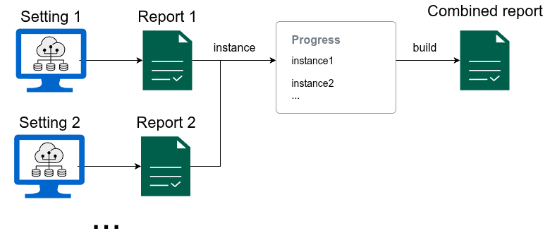

# Aggregate reports

A mechanism provided by FairBench to gather
fairness reports and aggregate them into one larger assessment
is the `Progress` class. This implements
a builder pattern in which new reports are registered
sequentially, and at any point an amalgamated report can be extracted.
The same pattern can be used for reports that show the evolution
of datasets and algorithms over time 
(both tracked progress and reports can be serialized to and from Json,
which allows for persistence if needed).

Gathering reports together allows for joint exploration,
visualization, and even reductions like obtaining the average
and standard deviation of all values across experiment settings. 
The builder pattern and these options are covered in this document.



## Gather instances

Below is how to add report instances to a `Progress`
builder. The example generates different reports for
different binary classification decision thresholds,
and a report is generated for each threshold. The
`instance` method is then used to register reports
so that one super-report can be built with the
`build` method. As a first step, the example
visualizes the maximum measure differences between demographic
group. Like normal, this specialization preserves
the structural organization of the report, namely 
that first the repost is split per threshold and only 
afterwards per measure.

```python
import fairbench as fb
import numpy as np

x, y, yhat = fb.bench.tabular.bank(predict="probabilities")
sensitive = fb.Dimensions(fb.categories @ x["marital"])

comparison = fb.Progress("thresholds")
for threshold in np.arange(0.1, 0.91, 0.1):
    report = fb.reports.pairwise(sensitive=sensitive, predictions=yhat>threshold, labels=y)
    comparison.instance(f"Threshold {threshold:.1f}", report)
comparison = comparison.build()
comparison.maxdiff.show(env=fb.export.Html)
```

<iframe
  src="/preview_progress_diffs.html"
  style="border: 1px solid black; width: 144%;height: 700px;border: none;margin-bottom:-100px;transform:scale(0.7);transform-origin: top left;overflow: auto"
></iframe>

## Transposing the view

A particularly handy transformation for reports consistes of applying
`.explain` on them, which exchanges the top two
organization layers. Applying it below lets us to split the maximum differences
across all reports across measures.

```python
comparison.maxdiff.explain.show(env=fb.export.Html, depth=0)
```

<iframe
  src="/preview_progress_explain.html"
  style="border: 1px solid black; width: 144%;height: 700px;border: none;margin-bottom:-100px;transform:scale(0.7);transform-origin: top left;overflow: auto"
></iframe>


## Persistence

Serialization and deserialization allow you to maintain fairness report or collections
of reports in `Progress` instances across
multiple application runs. For example this features can help investigate algorithm or dataset evolution
over time by retaining previous reports. To perform serialization, use the `status` property of a `Progress`
object to peek at its current build outcome without clearing gathered instances. Then perform the serialization
by converting the status into dictionaries and lists and using any framework. Here
is an example where json is used to perform the serialization:

```python
import json

dict_form = comparison.status.to_dict()
with open("comparison.json", "w") as file:
    json.dump(serialized, file)
```

Deserializing from the file entails the inverse procedure, in which a `Value` holding
the report outcome is deserialized and then passed to the `Progress` constructor to
continue building.

```python
with open("comparison.json", "r") as file:
    dict_form = json.load(file)

status = fb.core.Value.from_dict(dict_form)
comparison = fb.Progress(status)
```

## Applying reductions

FairBench already provides reduction mechanisms to aggregate fairness measures across
groups or subgroups. These can also be applied as filters, granted that they
encounter the same units across all dimensions when attempting a reduction (this check
is enforced for sanity).

```python
mean_comparison = comparison.status.filter(fb.reduction.mean)
mean_comparison.show(fb.export.ConsoleTable)
```