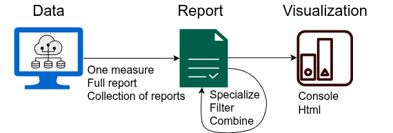

# Reports

Reports perform multi-faceted analyses of AI system outcomes
(e.g., predictions, recommendations, regression scores)
that typically quantify biases and fairness. Intermediate
computations are retained so that you can specialize
to viewing sub-reports or computation internals.

Furthermore, filters can be applied to augment
the organization or apply rules (e.g., thresholding 
criteria) to report outcomes. The end-result
is shown using various visualization environments.



!!! tip
    A more to-the-point tutorial than this documentation can be found
    [here](../reports.md). Here we we focus on describing details
    of the interface.

## Report types

Out-of-the box, use one of the following
report generation methods:

| Report        | Description                                                                                                                                                                                                            |
|---------------|------------------------------------------------------------------------------------------------------------------------------------------------------------------------------------------------------------------------|
| `fb.pairwise` | Compares groups pairwise when needed.                                                                                                                                                                                  |
| `fb.vsall`    | Adds the whole population as an 'all' group and, when possible, defaults to measures that compare other groups to 'all'.                                                                                               |
| `fb.conflate` | Creates a conflation matrix (a generalization of the confusion matrix whose entries are pairwise reports) between each subgroup pair. Values of these comparisons are not aggregated but instead retained as they are. |

Glimpse below example usage if the first report type 
for a binary classification task. Report types are interoperable;
the other two can be called by just substituting their name
in the same workflow. Of course, with different results.

Arguments, specialization,
and visualization are discussed afterwards in this document.
The example task contains binary predictions, binary
ideal predictions and multiclass
sensitive dimensions `sensitive` that separate between
*men* and *women*. The `show` method is used
to print the report to the console in a simple yet verbose
format. This is the default visualization environment.

```python
import fairbench as fb

sensitive = fb.Dimensions(men=[1, 1, 0, 0, 0], women=[0, 0, 1, 1, 1])
report = fb.reports.pairwise(
    predictions=[1, 0, 1, 0, 0], 
    labels=[1, 0, 0, 1, 0], 
    sensitive=sensitive
)
report.show()
```

This has the following outcome. Notice that descriptions
are provided for non-terminal values. 
Other [visualizations](../material/visualization.md) can
look very different and also be customized.
<pre style="height:700px;overflow-y:auto;font-family:monospace;background:#222222;color:#c0c0c0;padding:1em;overflow-x:auto;font-size:12px">

<span style="color:#5f82c7">##### multidim #####</span>
|This<span style="color:#7fbf8f"> is </span>analysis<span style="color:#7fbf8f"> that </span>compares several groups.
|
|Computations cover several cases.

 <span style="color:#5f82c7">***** min *****</span>
 |This reduction<span style="color:#7fbf8f"> is </span>the minimum.
 |Computations cover several cases.
 
   (0.0, 0.5)
   ▎          <span style="color:#7f9fd4">█                        
   </span>▎ <span style="color:#d47f7f">█  </span><span style="color:#7fbf8f">█     </span><span style="color:#7f9fd4">█              </span><span style="color:#d47f7f">█         
   </span>▎ <span style="color:#d47f7f">█  </span><span style="color:#7fbf8f">█     </span><span style="color:#7f9fd4">█              </span><span style="color:#d47f7f">█         
   </span>▎ <span style="color:#d47f7f">*  <span style="color:#7fbf8f">-  <span style="color:#c8aa7a">+  <span style="color:#7f9fd4">x  <span style="color:#b47fc4">o  <span style="color:#7fc0ca">□  <span style="color:#c8aa7a">◇  <span style="color:#7fc0ca">#  <span style="color:#d47f7f">@  <span style="color:#7fbf8f">%  <span style="color:#7f9fd4">&  <span style="color:#b47fc4">|
   </span></span></span></span></span></span></span></span></span></span></span></span>▎                                   
   ▎▬▬▬▬▬▬▬▬▬▬▬▬▬▬▬▬▬▬▬▬▬▬▬▬▬▬▬▬▬▬▬<span style="color:#7f9fd4">▆</span>▬▬<span style="color:#b47fc4">▆</span>
            (12.0, -0.5000000000000001)
   
    <span style="color:#d47f7f">* </span>acc                               0.333 min acc
    <span style="color:#7fbf8f">- </span>pr                                0.333 min pr
    <span style="color:#c8aa7a">+ </span>tpr                               0 min tpr
    <span style="color:#7f9fd4">x </span>tnr                               0.500 min tnr
    <span style="color:#b47fc4">o </span>ppv                               0 min ppv
    <span style="color:#7fc0ca">□ </span>f1                                0 min f1
    <span style="color:#c8aa7a">◇ </span>gmi                               0 min gmi
    <span style="color:#7fc0ca"># </span>tar                               0 min tar
    <span style="color:#d47f7f">@ </span>trr                               0.333 min trr
    <span style="color:#7fbf8f">% </span>lift                              0 min lift
    <span style="color:#7f9fd4">& </span>mcc                               -0.500 min mcc
    <span style="color:#b47fc4">| </span>kappa                             -0.500 min kappa
 
 <span style="color:#5f82c7">***** max *****</span>
 |This reduction<span style="color:#7fbf8f"> is </span>the maximum.
 |Computations cover several cases.
 
   (0.0, 2.0)
   ▎          <span style="color:#7f9fd4">█
   </span>▎          <span style="color:#7f9fd4">█
   </span>▎          <span style="color:#7f9fd4">█
   </span>▎          <span style="color:#7f9fd4">█
   </span>▎ <span style="color:#d47f7f">▄  </span><span style="color:#7fbf8f">▄  </span><span style="color:#c8aa7a">▄  </span><span style="color:#7f9fd4">█
   </span>▎▬<span style="color:#d47f7f">*</span>▬▬<span style="color:#7fbf8f">-</span>▬▬<span style="color:#c8aa7a">+</span>▬▬<span style="color:#7f9fd4">x</span>
     (4.0, 0.0)
   
    <span style="color:#d47f7f">* </span>pr                                0.500 max pr
    <span style="color:#7fbf8f">- </span>tar                               0.500 max tar
    <span style="color:#c8aa7a">+ </span>trr                               0.500 max trr
    <span style="color:#7f9fd4">x </span>lift                              2 max lift
 
 <span style="color:#5f82c7">***** maxerror *****</span>
 |This reduction<span style="color:#7fbf8f"> is </span>the maximum deviation from the ideal value.
 |Computations cover several cases.
 
   (0.0, 1.5)
   ▎                   <span style="color:#c8aa7a">█  </span><span style="color:#7fc0ca">█
   </span>▎                   <span style="color:#c8aa7a">█  </span><span style="color:#7fc0ca">█
   </span>▎    <span style="color:#7fbf8f">█     </span><span style="color:#7f9fd4">█  </span><span style="color:#b47fc4">█  </span><span style="color:#7fc0ca">█  </span><span style="color:#c8aa7a">█  </span><span style="color:#7fc0ca">█
   </span>▎ <span style="color:#d47f7f">▄  </span><span style="color:#7fbf8f">█     </span><span style="color:#7f9fd4">█  </span><span style="color:#b47fc4">█  </span><span style="color:#7fc0ca">█  </span><span style="color:#c8aa7a">█  </span><span style="color:#7fc0ca">█
   </span>▎ <span style="color:#d47f7f">█  </span><span style="color:#7fbf8f">█  </span><span style="color:#c8aa7a">█  </span><span style="color:#7f9fd4">█  </span><span style="color:#b47fc4">█  </span><span style="color:#7fc0ca">█  </span><span style="color:#c8aa7a">█  </span><span style="color:#7fc0ca">█
   </span>▎▬<span style="color:#d47f7f">*</span>▬▬<span style="color:#7fbf8f">-</span>▬▬<span style="color:#c8aa7a">+</span>▬▬<span style="color:#7f9fd4">x</span>▬▬<span style="color:#b47fc4">o</span>▬▬<span style="color:#7fc0ca">□</span>▬▬<span style="color:#c8aa7a">◇</span>▬▬<span style="color:#7fc0ca">#</span>
                 (8.0, 0.0)
   
    <span style="color:#d47f7f">* </span>acc                               0.667 maxerror acc
    <span style="color:#7fbf8f">- </span>tpr                               1 maxerror tpr
    <span style="color:#c8aa7a">+ </span>tnr                               0.500 maxerror tnr
    <span style="color:#7f9fd4">x </span>ppv                               1 maxerror ppv
    <span style="color:#b47fc4">o </span>f1                                1 maxerror f1
    <span style="color:#7fc0ca">□ </span>gmi                               1 maxerror gmi
    <span style="color:#c8aa7a">◇ </span>mcc                               1 maxerror mcc
    <span style="color:#7fc0ca"># </span>kappa                             1 maxerror kappa
 
 <span style="color:#5f82c7">***** wmean *****</span>
 |This reduction<span style="color:#7fbf8f"> is </span>the weighted average.
 |Computations cover several cases.
 
   (0.0, 0.8)
   ▎                      <span style="color:#7fc0ca">█   
   </span>▎          <span style="color:#7f9fd4">█           </span><span style="color:#7fc0ca">█   
   </span>▎ <span style="color:#d47f7f">▄        </span><span style="color:#7f9fd4">█           </span><span style="color:#7fc0ca">█   
   </span>▎ <span style="color:#d47f7f">█  </span><span style="color:#7fbf8f">█  </span><span style="color:#c8aa7a">█  </span><span style="color:#7f9fd4">█  </span><span style="color:#b47fc4">█     </span><span style="color:#c8aa7a">█  </span><span style="color:#7fc0ca">█   
   </span>▎ <span style="color:#d47f7f">█  </span><span style="color:#7fbf8f">█  </span><span style="color:#c8aa7a">█  </span><span style="color:#7f9fd4">█  </span><span style="color:#b47fc4">█  </span><span style="color:#7fc0ca">▄  </span><span style="color:#c8aa7a">█  </span><span style="color:#7fc0ca">█   
   </span>▎▬<span style="color:#d47f7f">*</span>▬▬<span style="color:#7fbf8f">-</span>▬▬<span style="color:#c8aa7a">+</span>▬▬<span style="color:#7f9fd4">x</span>▬▬<span style="color:#b47fc4">o</span>▬▬<span style="color:#7fc0ca">□</span>▬▬<span style="color:#c8aa7a">◇</span>▬▬<span style="color:#7fc0ca">#</span>▬▬<span style="color:#d47f7f">@</span>
                    (9.0, 0.0)
   
    <span style="color:#d47f7f">* </span>acc                               0.600 wmean acc
    <span style="color:#7fbf8f">- </span>pr                                0.400 wmean pr
    <span style="color:#c8aa7a">+ </span>tpr                               0.400 wmean tpr
    <span style="color:#7f9fd4">x </span>tnr                               0.700 wmean tnr
    <span style="color:#b47fc4">o </span>ppv                               0.400 wmean ppv
    <span style="color:#7fc0ca">□ </span>tar                               0.200 wmean tar
    <span style="color:#c8aa7a">◇ </span>trr                               0.400 wmean trr
    <span style="color:#7fc0ca"># </span>lift                              0.800 wmean lift
    <span style="color:#d47f7f">@ </span>kappa                             0.100 wmean kappa
 
 <span style="color:#5f82c7">***** mean *****</span>
 |This reduction<span style="color:#7fbf8f"> is </span>the average.
 |Computations cover several cases.
 
   (0.0, 1.0)
   ▎                            <span style="color:#7fbf8f">█      
   </span>▎                            <span style="color:#7fbf8f">█      
   </span>▎ <span style="color:#d47f7f">█        </span><span style="color:#7f9fd4">▄                 </span><span style="color:#7fbf8f">█      
   </span>▎ <span style="color:#d47f7f">█  </span><span style="color:#7fbf8f">▄  </span><span style="color:#c8aa7a">█  </span><span style="color:#7f9fd4">█  </span><span style="color:#b47fc4">█  </span><span style="color:#7fc0ca">█  </span><span style="color:#c8aa7a">█     </span><span style="color:#d47f7f">▄  </span><span style="color:#7fbf8f">█      
   </span>▎ <span style="color:#d47f7f">█  </span><span style="color:#7fbf8f">█  </span><span style="color:#c8aa7a">█  </span><span style="color:#7f9fd4">█  </span><span style="color:#b47fc4">█  </span><span style="color:#7fc0ca">█  </span><span style="color:#c8aa7a">█  </span><span style="color:#7fc0ca">▄  </span><span style="color:#d47f7f">█  </span><span style="color:#7fbf8f">█  </span><span style="color:#7f9fd4">▄  </span><span style="color:#b47fc4">▂
   </span>▎▬<span style="color:#d47f7f">*</span>▬▬<span style="color:#7fbf8f">-</span>▬▬<span style="color:#c8aa7a">+</span>▬▬<span style="color:#7f9fd4">x</span>▬▬<span style="color:#b47fc4">o</span>▬▬<span style="color:#7fc0ca">□</span>▬▬<span style="color:#c8aa7a">◇</span>▬▬<span style="color:#7fc0ca">#</span>▬▬<span style="color:#d47f7f">@</span>▬▬<span style="color:#7fbf8f">%</span>▬▬<span style="color:#7f9fd4">&</span>▬▬<span style="color:#b47fc4">|</span>
                            (12.0, 0.0)
   
    <span style="color:#d47f7f">* </span>acc                               0.667 mean acc
    <span style="color:#7fbf8f">- </span>pr                                0.417 mean pr
    <span style="color:#c8aa7a">+ </span>tpr                               0.500 mean tpr
    <span style="color:#7f9fd4">x </span>tnr                               0.750 mean tnr
    <span style="color:#b47fc4">o </span>ppv                               0.500 mean ppv
    <span style="color:#7fc0ca">□ </span>f1                                0.500 mean f1
    <span style="color:#c8aa7a">◇ </span>gmi                               0.500 mean gmi
    <span style="color:#7fc0ca"># </span>tar                               0.250 mean tar
    <span style="color:#d47f7f">@ </span>trr                               0.417 mean trr
    <span style="color:#7fbf8f">% </span>lift                              1 mean lift
    <span style="color:#7f9fd4">& </span>mcc                               0.250 mean mcc
    <span style="color:#b47fc4">| </span>kappa                             0.250 mean kappa
 
 <span style="color:#5f82c7">***** gm *****</span>
 |This reduction<span style="color:#7fbf8f"> is </span>the geometric mean.
 |Computations cover several cases.
 
   (0.0, 0.7071067811865476)
   ▎          <span style="color:#7f9fd4">█                  
   </span>▎ <span style="color:#d47f7f">▆        </span><span style="color:#7f9fd4">█                  
   </span>▎ <span style="color:#d47f7f">█        </span><span style="color:#7f9fd4">█                  
   </span>▎ <span style="color:#d47f7f">█  </span><span style="color:#7fbf8f">▂     </span><span style="color:#7f9fd4">█              </span><span style="color:#d47f7f">▂   
   </span>▎ <span style="color:#d47f7f">█  </span><span style="color:#7fbf8f">█     </span><span style="color:#7f9fd4">█              </span><span style="color:#d47f7f">█   
   </span>▎▬<span style="color:#d47f7f">*</span>▬▬<span style="color:#7fbf8f">-</span>▬▬<span style="color:#c8aa7a">+</span>▬▬<span style="color:#7f9fd4">x</span>▬▬<span style="color:#b47fc4">o</span>▬▬<span style="color:#7fc0ca">□</span>▬▬<span style="color:#c8aa7a">◇</span>▬▬<span style="color:#7fc0ca">#</span>▬▬<span style="color:#d47f7f">@</span>▬▬<span style="color:#7fbf8f">%</span>
                      (10.0, 0.0)
   
    <span style="color:#d47f7f">* </span>acc                               0.577 gm acc
    <span style="color:#7fbf8f">- </span>pr                                0.408 gm pr
    <span style="color:#c8aa7a">+ </span>tpr                               0 gm tpr
    <span style="color:#7f9fd4">x </span>tnr                               0.707 gm tnr
    <span style="color:#b47fc4">o </span>ppv                               0 gm ppv
    <span style="color:#7fc0ca">□ </span>f1                                0 gm f1
    <span style="color:#c8aa7a">◇ </span>gmi                               0 gm gmi
    <span style="color:#7fc0ca"># </span>tar                               0 gm tar
    <span style="color:#d47f7f">@ </span>trr                               0.408 gm trr
    <span style="color:#7fbf8f">% </span>lift                              0 gm lift
 
 <span style="color:#5f82c7">***** pnorm *****</span>
 |This reduction<span style="color:#7fbf8f"> is </span>the p-norm (default L2).
 |Computations cover several cases.
 
   (0.0, 2.0)
   ▎                            <span style="color:#7fbf8f">█      
   </span>▎                            <span style="color:#7fbf8f">█      
   </span>▎                            <span style="color:#7fbf8f">█      
   </span>▎ <span style="color:#d47f7f">█     </span><span style="color:#c8aa7a">█  </span><span style="color:#7f9fd4">▂  </span><span style="color:#b47fc4">█  </span><span style="color:#7fc0ca">█  </span><span style="color:#c8aa7a">█        </span><span style="color:#7fbf8f">█  </span><span style="color:#7f9fd4">▂  </span><span style="color:#b47fc4">▂
   </span>▎ <span style="color:#d47f7f">█  </span><span style="color:#7fbf8f">▆  </span><span style="color:#c8aa7a">█  </span><span style="color:#7f9fd4">█  </span><span style="color:#b47fc4">█  </span><span style="color:#7fc0ca">█  </span><span style="color:#c8aa7a">█  </span><span style="color:#7fc0ca">▄  </span><span style="color:#d47f7f">▆  </span><span style="color:#7fbf8f">█  </span><span style="color:#7f9fd4">█  </span><span style="color:#b47fc4">█
   </span>▎▬<span style="color:#d47f7f">*</span>▬▬<span style="color:#7fbf8f">-</span>▬▬<span style="color:#c8aa7a">+</span>▬▬<span style="color:#7f9fd4">x</span>▬▬<span style="color:#b47fc4">o</span>▬▬<span style="color:#7fc0ca">□</span>▬▬<span style="color:#c8aa7a">◇</span>▬▬<span style="color:#7fc0ca">#</span>▬▬<span style="color:#d47f7f">@</span>▬▬<span style="color:#7fbf8f">%</span>▬▬<span style="color:#7f9fd4">&</span>▬▬<span style="color:#b47fc4">|</span>
                            (12.0, 0.0)
   
    <span style="color:#d47f7f">* </span>acc                               1 pnorm acc
    <span style="color:#7fbf8f">- </span>pr                                0.601 pnorm pr
    <span style="color:#c8aa7a">+ </span>tpr                               1 pnorm tpr
    <span style="color:#7f9fd4">x </span>tnr                               1 pnorm tnr
    <span style="color:#b47fc4">o </span>ppv                               1 pnorm ppv
    <span style="color:#7fc0ca">□ </span>f1                                1 pnorm f1
    <span style="color:#c8aa7a">◇ </span>gmi                               1 pnorm gmi
    <span style="color:#7fc0ca"># </span>tar                               0.500 pnorm tar
    <span style="color:#d47f7f">@ </span>trr                               0.601 pnorm trr
    <span style="color:#7fbf8f">% </span>lift                              2 pnorm lift
    <span style="color:#7f9fd4">& </span>mcc                               1 pnorm mcc
    <span style="color:#b47fc4">| </span>kappa                             1 pnorm kappa
 
 <span style="color:#5f82c7">***** maxrel *****</span>
 |This reduction<span style="color:#7fbf8f"> is </span>the maximum relative difference.
 |Computations cover several cases.
 
   (0.0, 1.0)
   ▎       <span style="color:#c8aa7a">█     </span><span style="color:#b47fc4">█  </span><span style="color:#7fc0ca">█  </span><span style="color:#c8aa7a">█  </span><span style="color:#7fc0ca">█     </span><span style="color:#7fbf8f">█      
   </span>▎       <span style="color:#c8aa7a">█     </span><span style="color:#b47fc4">█  </span><span style="color:#7fc0ca">█  </span><span style="color:#c8aa7a">█  </span><span style="color:#7fc0ca">█     </span><span style="color:#7fbf8f">█      
   </span>▎ <span style="color:#d47f7f">█     </span><span style="color:#c8aa7a">█     </span><span style="color:#b47fc4">█  </span><span style="color:#7fc0ca">█  </span><span style="color:#c8aa7a">█  </span><span style="color:#7fc0ca">█     </span><span style="color:#7fbf8f">█      
   </span>▎ <span style="color:#d47f7f">█     </span><span style="color:#c8aa7a">█  </span><span style="color:#7f9fd4">█  </span><span style="color:#b47fc4">█  </span><span style="color:#7fc0ca">█  </span><span style="color:#c8aa7a">█  </span><span style="color:#7fc0ca">█     </span><span style="color:#7fbf8f">█  </span><span style="color:#7f9fd4">█  </span><span style="color:#b47fc4">▆
   </span>▎ <span style="color:#d47f7f">█  </span><span style="color:#7fbf8f">█  </span><span style="color:#c8aa7a">█  </span><span style="color:#7f9fd4">█  </span><span style="color:#b47fc4">█  </span><span style="color:#7fc0ca">█  </span><span style="color:#c8aa7a">█  </span><span style="color:#7fc0ca">█  </span><span style="color:#d47f7f">█  </span><span style="color:#7fbf8f">█  </span><span style="color:#7f9fd4">█  </span><span style="color:#b47fc4">█
   </span>▎▬<span style="color:#d47f7f">*</span>▬▬<span style="color:#7fbf8f">-</span>▬▬<span style="color:#c8aa7a">+</span>▬▬<span style="color:#7f9fd4">x</span>▬▬<span style="color:#b47fc4">o</span>▬▬<span style="color:#7fc0ca">□</span>▬▬<span style="color:#c8aa7a">◇</span>▬▬<span style="color:#7fc0ca">#</span>▬▬<span style="color:#d47f7f">@</span>▬▬<span style="color:#7fbf8f">%</span>▬▬<span style="color:#7f9fd4">&</span>▬▬<span style="color:#b47fc4">|</span>
                            (12.0, 0.0)
   
    <span style="color:#d47f7f">* </span>acc                               0.667 maxrel acc
    <span style="color:#7fbf8f">- </span>pr                                0.333 maxrel pr
    <span style="color:#c8aa7a">+ </span>tpr                               1 maxrel tpr
    <span style="color:#7f9fd4">x </span>tnr                               0.500 maxrel tnr
    <span style="color:#b47fc4">o </span>ppv                               1 maxrel ppv
    <span style="color:#7fc0ca">□ </span>f1                                1 maxrel f1
    <span style="color:#c8aa7a">◇ </span>gmi                               1 maxrel gmi
    <span style="color:#7fc0ca"># </span>tar                               1 maxrel tar
    <span style="color:#d47f7f">@ </span>trr                               0.333 maxrel trr
    <span style="color:#7fbf8f">% </span>lift                              1 maxrel lift
    <span style="color:#7f9fd4">& </span>mcc                               0.500 maxrel mcc
    <span style="color:#b47fc4">| </span>kappa                             0.500 maxrel kappa
 
 <span style="color:#5f82c7">***** maxdiff *****</span>
 |This reduction<span style="color:#7fbf8f"> is </span>the maximum difference.
 |Computations cover several cases.
 
   (0.0, 2.0)
   ▎                            <span style="color:#7fbf8f">█      
   </span>▎                            <span style="color:#7fbf8f">█      
   </span>▎                            <span style="color:#7fbf8f">█  </span><span style="color:#7f9fd4">▄  </span><span style="color:#b47fc4">▄
   </span>▎       <span style="color:#c8aa7a">█     </span><span style="color:#b47fc4">█  </span><span style="color:#7fc0ca">█  </span><span style="color:#c8aa7a">█        </span><span style="color:#7fbf8f">█  </span><span style="color:#7f9fd4">█  </span><span style="color:#b47fc4">█
   </span>▎ <span style="color:#d47f7f">█     </span><span style="color:#c8aa7a">█  </span><span style="color:#7f9fd4">▄  </span><span style="color:#b47fc4">█  </span><span style="color:#7fc0ca">█  </span><span style="color:#c8aa7a">█  </span><span style="color:#7fc0ca">▄     </span><span style="color:#7fbf8f">█  </span><span style="color:#7f9fd4">█  </span><span style="color:#b47fc4">█
   </span>▎▬<span style="color:#d47f7f">*</span>▬▬<span style="color:#7fbf8f">-</span>▬▬<span style="color:#c8aa7a">+</span>▬▬<span style="color:#7f9fd4">x</span>▬▬<span style="color:#b47fc4">o</span>▬▬<span style="color:#7fc0ca">□</span>▬▬<span style="color:#c8aa7a">◇</span>▬▬<span style="color:#7fc0ca">#</span>▬▬<span style="color:#d47f7f">@</span>▬▬<span style="color:#7fbf8f">%</span>▬▬<span style="color:#7f9fd4">&</span>▬▬<span style="color:#b47fc4">|</span>
                            (12.0, 0.0)
   
    <span style="color:#d47f7f">* </span>acc                               0.667 maxdiff acc
    <span style="color:#7fbf8f">- </span>pr                                0.167 maxdiff pr
    <span style="color:#c8aa7a">+ </span>tpr                               1 maxdiff tpr
    <span style="color:#7f9fd4">x </span>tnr                               0.500 maxdiff tnr
    <span style="color:#b47fc4">o </span>ppv                               1 maxdiff ppv
    <span style="color:#7fc0ca">□ </span>f1                                1 maxdiff f1
    <span style="color:#c8aa7a">◇ </span>gmi                               1 maxdiff gmi
    <span style="color:#7fc0ca"># </span>tar                               0.500 maxdiff tar
    <span style="color:#d47f7f">@ </span>trr                               0.167 maxdiff trr
    <span style="color:#7fbf8f">% </span>lift                              2 maxdiff lift
    <span style="color:#7f9fd4">& </span>mcc                               1 maxdiff mcc
    <span style="color:#b47fc4">| </span>kappa                             1 maxdiff kappa
 
 <span style="color:#5f82c7">***** gini *****</span>
 |This reduction<span style="color:#7fbf8f"> is </span>the gini coefficient.
 |Computations cover several cases.
 
   (0.0, 1.5000000000000004)
   ▎                                  <span style="color:#b47fc4">█
   </span>▎                               <span style="color:#7f9fd4">▆  </span><span style="color:#b47fc4">█
   </span>▎                               <span style="color:#7f9fd4">█  </span><span style="color:#b47fc4">█
   </span>▎                               <span style="color:#7f9fd4">█  </span><span style="color:#b47fc4">█
   </span>▎       <span style="color:#c8aa7a">▆     </span><span style="color:#b47fc4">▆  </span><span style="color:#7fc0ca">▆  </span><span style="color:#c8aa7a">▆  </span><span style="color:#7fc0ca">▆     </span><span style="color:#7fbf8f">▆  </span><span style="color:#7f9fd4">█  </span><span style="color:#b47fc4">█
   </span>▎▬<span style="color:#d47f7f">*</span>▬▬<span style="color:#7fbf8f">-</span>▬▬<span style="color:#c8aa7a">+</span>▬▬<span style="color:#7f9fd4">x</span>▬▬<span style="color:#b47fc4">o</span>▬▬<span style="color:#7fc0ca">□</span>▬▬<span style="color:#c8aa7a">◇</span>▬▬<span style="color:#7fc0ca">#</span>▬▬<span style="color:#d47f7f">@</span>▬▬<span style="color:#7fbf8f">%</span>▬▬<span style="color:#7f9fd4">&</span>▬▬<span style="color:#b47fc4">|</span>
                            (12.0, 0.0)
   
    <span style="color:#d47f7f">* </span>acc                               0.250 gini acc
    <span style="color:#7fbf8f">- </span>pr                                0.100 gini pr
    <span style="color:#c8aa7a">+ </span>tpr                               0.500 gini tpr
    <span style="color:#7f9fd4">x </span>tnr                               0.167 gini tnr
    <span style="color:#b47fc4">o </span>ppv                               0.500 gini ppv
    <span style="color:#7fc0ca">□ </span>f1                                0.500 gini f1
    <span style="color:#c8aa7a">◇ </span>gmi                               0.500 gini gmi
    <span style="color:#7fc0ca"># </span>tar                               0.500 gini tar
    <span style="color:#d47f7f">@ </span>trr                               0.100 gini trr
    <span style="color:#7fbf8f">% </span>lift                              0.500 gini lift
    <span style="color:#7f9fd4">& </span>mcc                               1 gini mcc
    <span style="color:#b47fc4">| </span>kappa                             1 gini kappa
 
 <span style="color:#5f82c7">***** stdx2 *****</span>
 |This reduction<span style="color:#7fbf8f"> is </span>the standard deviation x2.
 |Computations cover several cases.
 
   (0.0, 2.0)
   ▎                            <span style="color:#7fbf8f">█      
   </span>▎                            <span style="color:#7fbf8f">█      
   </span>▎                            <span style="color:#7fbf8f">█  </span><span style="color:#7f9fd4">▄  </span><span style="color:#b47fc4">▄
   </span>▎       <span style="color:#c8aa7a">█     </span><span style="color:#b47fc4">█  </span><span style="color:#7fc0ca">█  </span><span style="color:#c8aa7a">█        </span><span style="color:#7fbf8f">█  </span><span style="color:#7f9fd4">█  </span><span style="color:#b47fc4">█
   </span>▎ <span style="color:#d47f7f">█     </span><span style="color:#c8aa7a">█  </span><span style="color:#7f9fd4">▄  </span><span style="color:#b47fc4">█  </span><span style="color:#7fc0ca">█  </span><span style="color:#c8aa7a">█  </span><span style="color:#7fc0ca">▄     </span><span style="color:#7fbf8f">█  </span><span style="color:#7f9fd4">█  </span><span style="color:#b47fc4">█
   </span>▎▬<span style="color:#d47f7f">*</span>▬▬<span style="color:#7fbf8f">-</span>▬▬<span style="color:#c8aa7a">+</span>▬▬<span style="color:#7f9fd4">x</span>▬▬<span style="color:#b47fc4">o</span>▬▬<span style="color:#7fc0ca">□</span>▬▬<span style="color:#c8aa7a">◇</span>▬▬<span style="color:#7fc0ca">#</span>▬▬<span style="color:#d47f7f">@</span>▬▬<span style="color:#7fbf8f">%</span>▬▬<span style="color:#7f9fd4">&</span>▬▬<span style="color:#b47fc4">|</span>
                            (12.0, 0.0)
   
    <span style="color:#d47f7f">* </span>acc                               0.667 stdx2 acc
    <span style="color:#7fbf8f">- </span>pr                                0.167 stdx2 pr
    <span style="color:#c8aa7a">+ </span>tpr                               1 stdx2 tpr
    <span style="color:#7f9fd4">x </span>tnr                               0.500 stdx2 tnr
    <span style="color:#b47fc4">o </span>ppv                               1 stdx2 ppv
    <span style="color:#7fc0ca">□ </span>f1                                1 stdx2 f1
    <span style="color:#c8aa7a">◇ </span>gmi                               1 stdx2 gmi
    <span style="color:#7fc0ca"># </span>tar                               0.500 stdx2 tar
    <span style="color:#d47f7f">@ </span>trr                               0.167 stdx2 trr
    <span style="color:#7fbf8f">% </span>lift                              2 stdx2 lift
    <span style="color:#7f9fd4">& </span>mcc                               1 stdx2 mcc
    <span style="color:#b47fc4">| </span>kappa                             1 stdx2 kappa
</pre>


## Arguments

Reports automatically contain by default all available measures. However,
their results only contain measure that could be computed given appropriate
keyword arguments. For example, if you provide predicted labels but not output scores, the
report will not show regression or recommendation measures.
Base performance measures accept some combinations of the arguments bellow; those arguments
are thus what can be provided to reports to call those base measures.

| Argument         | Role                | Values                                                                |
|------------------|---------------------|-----------------------------------------------------------------------|
| predictions      | system output       | binary array                                                          |
| multipredictions | system output       | discrete array                                                        |
| scores           | system output       | array with elements in [0,1]                                          |
| targets          | prediction target   | array with elements in [0,1]                                          | 
| order            | order target        | array whose element order should be replicated (e.g., may have ranks) |      
| labels           | prediction target   | binary array                                                          |     
| multilabels      | prediction target   | discrete array                                                        | 
| sensitive        | sensitive attribute | fork of arrays with elements in [0,1] (either binary or fuzzy)        |


The following argument combinations are accepted for different predictive tasks. 
You can have more than one combination in the same report. For example, compute both 
binary classification and scoring measures in one go by providing *predictions,scores,labels,sensitive*.

- *multipredictions,multilabels,sensitive* for macro-averaged **multiclass classification**
- *predictions,labels,sensitive* for **classification** (can also be used in multiclass settings - see below)
- *scores,labels,sensitive* for **recommendation**
- *scores,targets,sensitive* for **regression**
- *scores,order,sensitive* for **ranking**

## More on multiclass

Sensitive attributes contain multiple
[dimensions](dimensions)
that treat multi-value attributes or multiple
sensitive attribute values interchangeably.

Normally, you can separate multiclass analysis
into analyzing each class separately by decomposing
target and predicted values into separate dimensions.
In these settings, all keyword arguments other than the 
sensitive attribute must have dimensions corresponding to the classes.

```python
predictions = fb.Dimensions(fb.categories@yhat)
labels = fb.Dimensions(fb.categories@y)
```

But you can also obtain macro-analysis that
considers various intra-class averages of measures
like accuracy, tpr, and ppv by passing discrete
predictions and labels via the *multipredictions*
and *multilabels* arguments.


## Visualization

The above example uses the `show` method to print to the console.
The same method can create various types of exports.
For example, view the report's outcome in the browser by using a different visualization
argument, such as with `report.show(env=fb.export.Html)`. Find a 
full list of visualization environments [here](../material/visualization.md).

The same method also admits a `depth` argument that determines
the level of detail, where the default is zero. At least the top
set of numeric values will be shown regardless of the detail level.
All visualization environments can work with any set depth, though
beware that large depths may create imprtactically many details;
you might want to specialize like below.

## Focusing on subsets of reports

You can focus on specific subsets of reports by using the dot
or getitem notations. For example, obtain all values related
to accuracy per `report.acc` or `report["acc"]`. More on
report exploration can be found [here](exploration.md), but this
functionality is mentioned here because the results are
also reports. Though of smaller scope, of course.

Conflate reports, in particular, can grow
are too long to parse with a glance, and 
meant to both specialize somewhat,
and visualize in matrix form with
the following pattern. Note that  the example 
also focuses on the "positive" 
class corresponding to prediction label `True`.
Everything can be omitted from the `.acc.largestmaxrel["True"]` 
specialization, which is equivalent to `["acc"]["largestmaxrel"]["True"]`,
depending on what should be analyzed.

```python
import fairbench as fb

x, y, yhat = fb.bench.tabular.compas(test_size=0.5)

sensitive = fb.Dimensions(fb.categories @ x["sex"], fb.categories @ x["race"])
sensitive = sensitive.intersectional().strict()

yhat = fb.Dimensions(fb.categories @ yhat)
y = fb.Dimensions(fb.categories @ y)

report = fb.reports.conflate(predictions=yhat, labels=y, sensitive=sensitive)
report.acc.largestmaxrel["True"].show(env=fb.export.HtmlTable)
```

!!! info
    Conflate reports are a more granular but also exceptionally
    harder to parse version of pairwise reports. They are 
    nonetheless included in preparation for compatibility with
    the prEN 18283 Bias standard. 
