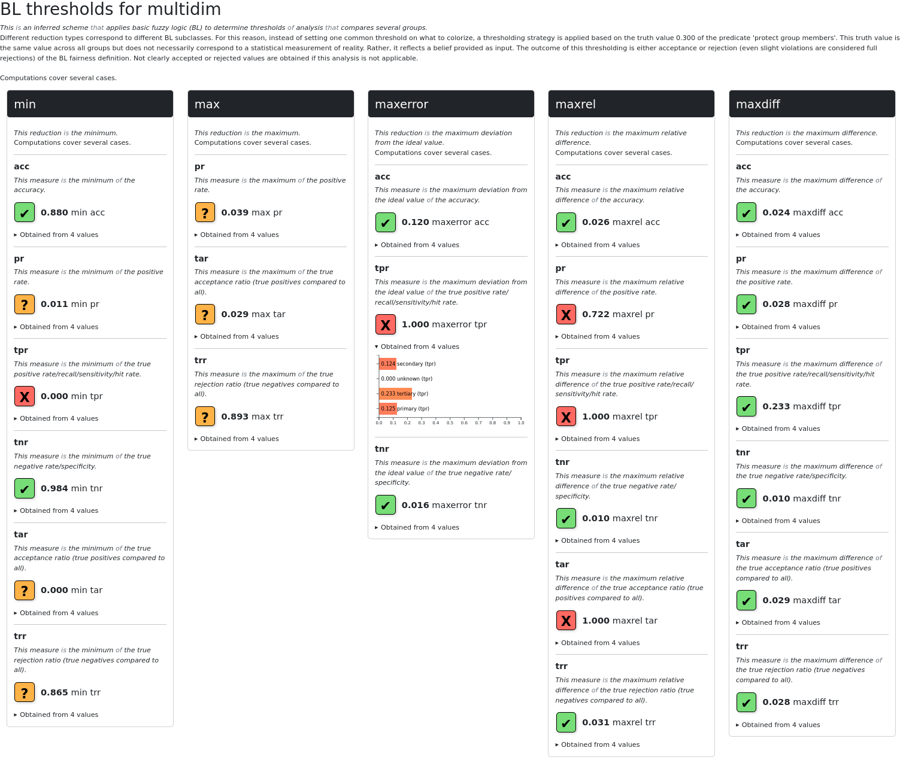

# Filters

Here are available filters that you can pass as positional arguments to 
the `filter` method of reports. Pass either the classes
or instantiated class objects to that method. Explanations
for filter arguments are provided too. Everything is imported
from the `investigate` module. 

## Stamps

It contains a collection of fairness assessment stamps, which correspond to popular literature definitions.
Only known stamps are retained from the report. However, these are enriched with caveats and recommendations 
coming from a socio-technical database of the MAMMOth EU project.


## IsBias

Keeps only report entries where values close to zero are considered better.
This way, all high values in the filtered report indicate violation of ideal behavior.


## DeviationsOver

Its main role is to simplify reports so that only unacceptable numerical deviations stand out.
These are its constructor arguments:

- `limit` Mandatory. A number that indicates maximally allowed deviations from ideal values. If it is not exceeded, report values are either omitted as unimportant or colored green.
- `prune` If set to `True`, it eliminates report values that could be considered not too problematic by not exceeding the set threshold. Otherwise, only coloring and symbol indicators of when values are close or far from ideal ones are affected.
- `shallow` A boolean value that is relevant on when a "keep" action is selected. If True (default), only the top numeric values are filtered. Otherwise the filter checks all internal values too.

## Worst

It applies a *DeviationsOver* filter, but the `limit` parameter is first automatically determined and set to the worst
deviation from ideal values across all measures. This always helps start from the most problematic values, but do note
that these may not be the biases of interest.

## BL

It has the same parameter and role as the *DeviationOver* filter. However, the threshold is set by a first
`encounter` argument, which translates to the truth value in the range [0,1] og the predicate 'protect group members'. 
This truth value is the same value across all groups but does not necessarily correspond to a statistical measurement of 
reality. Rather, it reflects a belief provided as input. The outcome of this thresholding is either acceptance
or rejection (even slight violations are considered full rejections) of the BL fairness definition. 
Not clearly accepted or rejected values are obtained if this analysis is not applicable.

!!! warning
    This filter captures a simplistic BL definition and may change in the future.

Below is an example of this filter in action. The investigation of other filters may be similarly applied.

```python
import fairbench as fb

test, y, yhat = fb.bench.tabular.bank()
sensitive = fb.Dimensions(fb.categories @ test["education"])
report = fb.reports.pairwise(sensitive=sensitive, predictions=yhat, labels=y)

report = report.filter(fb.investigate.BL(0.3, prune=False))
report.show(env=fb.export.Html(horizontal=True), depth=2)
```


