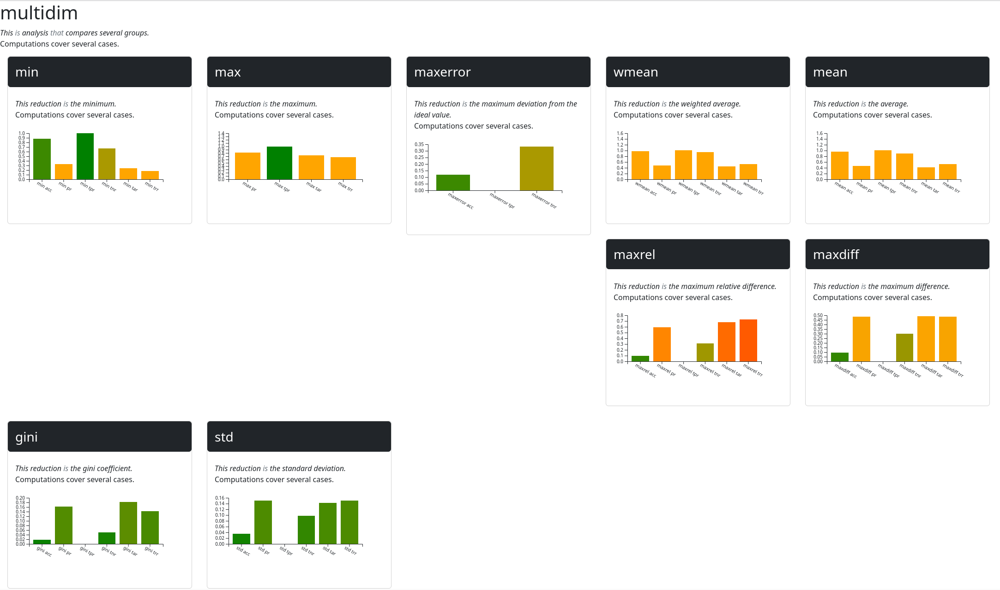
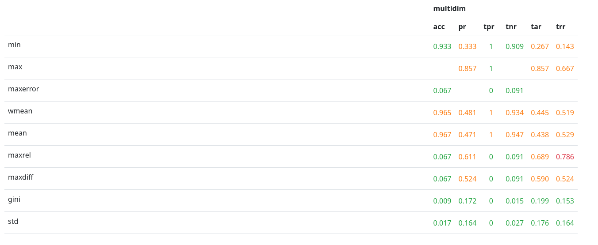
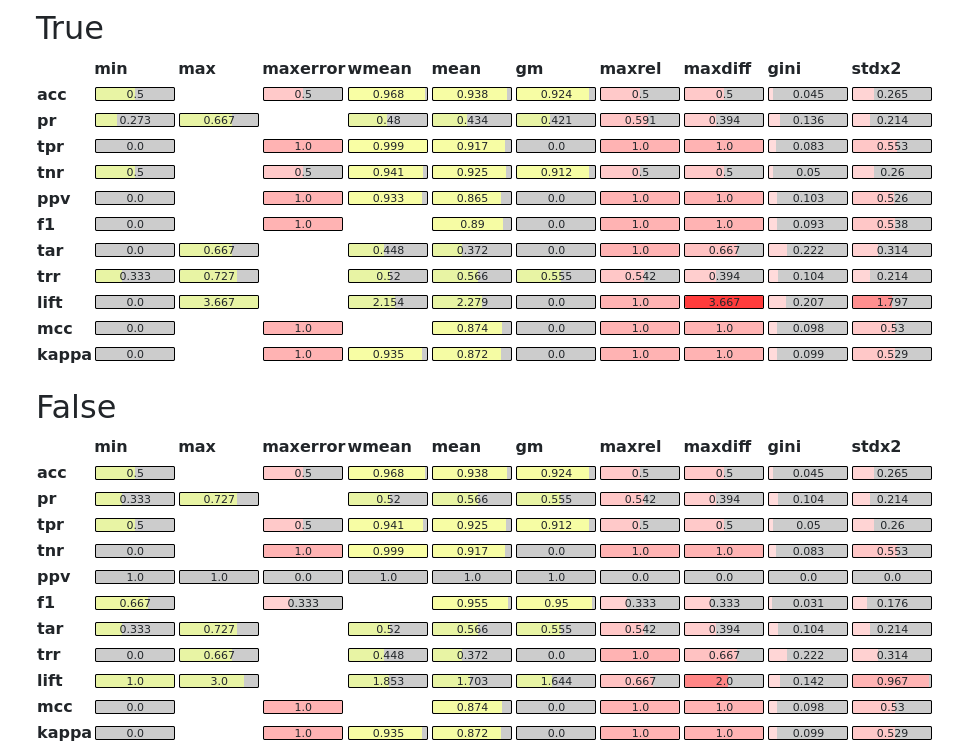

# Visualization

Reports accept visualization environments as arguments to their `show` method.
These environments exhibit various degrees of interactivity.

## Console

The default visualization environment prints all report
details in the console, using ANSI codes for color. 
It can also be selected by passing its class as an argument
to the `show` method, in which case it is instantiated
with default arguments.

```python
report.show(env=fb.export.Console)
```

<pre style="height:700px;overflow-y:auto;font-family:monospace;background:#222222;color:#c0c0c0;padding:1em;overflow-x:auto;font-size:12px">

<span style="color:#5f82c7">##### multidim #####</span>
|This<span style="color:#7fbf8f"> is </span>analysis<span style="color:#7fbf8f"> that </span>compares several groups.
|
|Computations cover several cases.

 <span style="color:#5f82c7">***** min *****</span>
 |This reduction<span style="color:#7fbf8f"> is </span>the minimum.
 |Computations cover several cases.
 
   (0.0, 0.9375)
   ▎ <span style="color:#d47f7f">█                                 
   </span>▎ <span style="color:#d47f7f">█        </span><span style="color:#7f9fd4">▆                        
   </span>▎ <span style="color:#d47f7f">█        </span><span style="color:#7f9fd4">█                        
   </span>▎ <span style="color:#d47f7f">█        </span><span style="color:#7f9fd4">█              </span><span style="color:#d47f7f">▄         
   </span>▎ <span style="color:#d47f7f">█        </span><span style="color:#7f9fd4">█              </span><span style="color:#d47f7f">█         
   </span>▎▬<span style="color:#d47f7f">*</span>▬▬<span style="color:#7fbf8f">-</span>▬▬<span style="color:#c8aa7a">+</span>▬▬<span style="color:#7f9fd4">x</span>▬▬<span style="color:#b47fc4">o</span>▬▬<span style="color:#7fc0ca">□</span>▬▬<span style="color:#c8aa7a">◇</span>▬▬<span style="color:#7fc0ca">#</span>▬▬<span style="color:#d47f7f">@</span>▬▬<span style="color:#7fbf8f">%</span>▬▬<span style="color:#7f9fd4">&</span>▬▬<span style="color:#b47fc4">|</span>
                            (12.0, 0.0)
   
    <span style="color:#d47f7f">* </span>acc                               0.938 min acc
    <span style="color:#7fbf8f">- </span>pr                                0 min pr
    <span style="color:#c8aa7a">+ </span>tpr                               0 min tpr
    <span style="color:#7f9fd4">x </span>tnr                               0.917 min tnr
    <span style="color:#b47fc4">o </span>ppv                               0 min ppv
    <span style="color:#7fc0ca">□ </span>f1                                0 min f1
    <span style="color:#c8aa7a">◇ </span>gmi                               0 min gmi
    <span style="color:#7fc0ca"># </span>tar                               0 min tar
    <span style="color:#d47f7f">@ </span>trr                               0.410 min trr
    <span style="color:#7fbf8f">% </span>lift                              0 min lift
    <span style="color:#7f9fd4">& </span>mcc                               0 min mcc
    <span style="color:#b47fc4">| </span>kappa                             0 min kappa
 
 <span style="color:#5f82c7">***** max *****</span>
 |This reduction<span style="color:#7fbf8f"> is </span>the maximum.
 |Computations cover several cases.
 
   (0.0, 4.857142857142858)
   ▎          <span style="color:#7f9fd4">█
   </span>▎          <span style="color:#7f9fd4">█
   </span>▎          <span style="color:#7f9fd4">█
   </span>▎          <span style="color:#7f9fd4">█
   </span>▎       <span style="color:#c8aa7a">█  </span><span style="color:#7f9fd4">█
   </span>▎▬<span style="color:#d47f7f">*</span>▬▬<span style="color:#7fbf8f">-</span>▬▬<span style="color:#c8aa7a">+</span>▬▬<span style="color:#7f9fd4">x</span>
     (4.0, 0.0)
   
    <span style="color:#d47f7f">* </span>pr                                0.590 max pr
    <span style="color:#7fbf8f">- </span>tar                               0.553 max tar
    <span style="color:#c8aa7a">+ </span>trr                               1 max trr
    <span style="color:#7f9fd4">x </span>lift                              4 max lift
 
 <span style="color:#5f82c7">***** maxerror *****</span>
 |This reduction<span style="color:#7fbf8f"> is </span>the maximum deviation from the ideal value.
 |Computations cover several cases.
 
   (0.0, 1.0)
   ▎    <span style="color:#7fbf8f">█     </span><span style="color:#7f9fd4">█  </span><span style="color:#b47fc4">█  </span><span style="color:#7fc0ca">█  </span><span style="color:#c8aa7a">█  </span><span style="color:#7fc0ca">█
   </span>▎    <span style="color:#7fbf8f">█     </span><span style="color:#7f9fd4">█  </span><span style="color:#b47fc4">█  </span><span style="color:#7fc0ca">█  </span><span style="color:#c8aa7a">█  </span><span style="color:#7fc0ca">█
   </span>▎    <span style="color:#7fbf8f">█     </span><span style="color:#7f9fd4">█  </span><span style="color:#b47fc4">█  </span><span style="color:#7fc0ca">█  </span><span style="color:#c8aa7a">█  </span><span style="color:#7fc0ca">█
   </span>▎    <span style="color:#7fbf8f">█     </span><span style="color:#7f9fd4">█  </span><span style="color:#b47fc4">█  </span><span style="color:#7fc0ca">█  </span><span style="color:#c8aa7a">█  </span><span style="color:#7fc0ca">█
   </span>▎    <span style="color:#7fbf8f">█     </span><span style="color:#7f9fd4">█  </span><span style="color:#b47fc4">█  </span><span style="color:#7fc0ca">█  </span><span style="color:#c8aa7a">█  </span><span style="color:#7fc0ca">█
   </span>▎▬<span style="color:#d47f7f">*</span>▬▬<span style="color:#7fbf8f">-</span>▬▬<span style="color:#c8aa7a">+</span>▬▬<span style="color:#7f9fd4">x</span>▬▬<span style="color:#b47fc4">o</span>▬▬<span style="color:#7fc0ca">□</span>▬▬<span style="color:#c8aa7a">◇</span>▬▬<span style="color:#7fc0ca">#</span>
                 (8.0, 0.0)
   
    <span style="color:#d47f7f">* </span>acc                               0.062 maxerror acc
    <span style="color:#7fbf8f">- </span>tpr                               1 maxerror tpr
    <span style="color:#c8aa7a">+ </span>tnr                               0.083 maxerror tnr
    <span style="color:#7f9fd4">x </span>ppv                               1 maxerror ppv
    <span style="color:#b47fc4">o </span>f1                                1 maxerror f1
    <span style="color:#7fc0ca">□ </span>gmi                               1 maxerror gmi
    <span style="color:#c8aa7a">◇ </span>mcc                               1 maxerror mcc
    <span style="color:#7fc0ca"># </span>kappa                             1 maxerror kappa
 
 <span style="color:#5f82c7">***** wmean *****</span>
 |This reduction<span style="color:#7fbf8f"> is </span>the weighted average.
 |Computations cover several cases.
 
   (0.0, 2.139759318396379)
   ▎                      <span style="color:#7fc0ca">█   
   </span>▎                      <span style="color:#7fc0ca">█   
   </span>▎                      <span style="color:#7fc0ca">█   
   </span>▎ <span style="color:#d47f7f">▄     </span><span style="color:#c8aa7a">▆  </span><span style="color:#7f9fd4">▄  </span><span style="color:#b47fc4">▄        </span><span style="color:#7fc0ca">█  </span><span style="color:#d47f7f">▄
   </span>▎ <span style="color:#d47f7f">█  </span><span style="color:#7fbf8f">▂  </span><span style="color:#c8aa7a">█  </span><span style="color:#7f9fd4">█  </span><span style="color:#b47fc4">█  </span><span style="color:#7fc0ca">▂  </span><span style="color:#c8aa7a">▂  </span><span style="color:#7fc0ca">█  </span><span style="color:#d47f7f">█
   </span>▎▬<span style="color:#d47f7f">*</span>▬▬<span style="color:#7fbf8f">-</span>▬▬<span style="color:#c8aa7a">+</span>▬▬<span style="color:#7f9fd4">x</span>▬▬<span style="color:#b47fc4">o</span>▬▬<span style="color:#7fc0ca">□</span>▬▬<span style="color:#c8aa7a">◇</span>▬▬<span style="color:#7fc0ca">#</span>▬▬<span style="color:#d47f7f">@</span>
                    (9.0, 0.0)
   
    <span style="color:#d47f7f">* </span>acc                               0.970 wmean acc
    <span style="color:#7fbf8f">- </span>pr                                0.488 wmean pr
    <span style="color:#c8aa7a">+ </span>tpr                               1.000 wmean tpr
    <span style="color:#7f9fd4">x </span>tnr                               0.941 wmean tnr
    <span style="color:#b47fc4">o </span>ppv                               0.939 wmean ppv
    <span style="color:#7fc0ca">□ </span>tar                               0.458 wmean tar
    <span style="color:#c8aa7a">◇ </span>trr                               0.512 wmean trr
    <span style="color:#7fc0ca"># </span>lift                              2 wmean lift
    <span style="color:#d47f7f">@ </span>kappa                             0.938 wmean kappa
 
 <span style="color:#5f82c7">***** mean *****</span>
 |This reduction<span style="color:#7fbf8f"> is </span>the average.
 |Computations cover several cases.
 
   (0.0, 2.509613085582719)
   ▎                            <span style="color:#7fbf8f">█      
   </span>▎                            <span style="color:#7fbf8f">█      
   </span>▎                            <span style="color:#7fbf8f">█      
   </span>▎                            <span style="color:#7fbf8f">█      
   </span>▎ <span style="color:#d47f7f">▂     </span><span style="color:#c8aa7a">█  </span><span style="color:#7f9fd4">▂  </span><span style="color:#b47fc4">█  </span><span style="color:#7fc0ca">█  </span><span style="color:#c8aa7a">█     </span><span style="color:#d47f7f">▄  </span><span style="color:#7fbf8f">█  </span><span style="color:#7f9fd4">█  </span><span style="color:#b47fc4">█
   </span>▎▬<span style="color:#d47f7f">*</span>▬▬<span style="color:#7fbf8f">-</span>▬▬<span style="color:#c8aa7a">+</span>▬▬<span style="color:#7f9fd4">x</span>▬▬<span style="color:#b47fc4">o</span>▬▬<span style="color:#7fc0ca">□</span>▬▬<span style="color:#c8aa7a">◇</span>▬▬<span style="color:#7fc0ca">#</span>▬▬<span style="color:#d47f7f">@</span>▬▬<span style="color:#7fbf8f">%</span>▬▬<span style="color:#7f9fd4">&</span>▬▬<span style="color:#b47fc4">|</span>
                            (12.0, 0.0)
   
    <span style="color:#d47f7f">* </span>acc                               0.981 mean acc
    <span style="color:#7fbf8f">- </span>pr                                0.368 mean pr
    <span style="color:#c8aa7a">+ </span>tpr                               0.917 mean tpr
    <span style="color:#7f9fd4">x </span>tnr                               0.968 mean tnr
    <span style="color:#b47fc4">o </span>ppv                               0.868 mean ppv
    <span style="color:#7fc0ca">□ </span>f1                                0.891 mean f1
    <span style="color:#c8aa7a">◇ </span>gmi                               0.891 mean gmi
    <span style="color:#7fc0ca"># </span>tar                               0.349 mean tar
    <span style="color:#d47f7f">@ </span>trr                               0.632 mean trr
    <span style="color:#7fbf8f">% </span>lift                              2 mean lift
    <span style="color:#7f9fd4">& </span>mcc                               0.876 mean mcc
    <span style="color:#b47fc4">| </span>kappa                             0.874 mean kappa
 
 <span style="color:#5f82c7">***** gm *****</span>
 |This reduction<span style="color:#7fbf8f"> is </span>the geometric mean.
 |Computations cover several cases.
 
   (0.0, 0.98060782482763)
   ▎ <span style="color:#d47f7f">█                                 
   </span>▎ <span style="color:#d47f7f">█        </span><span style="color:#7f9fd4">▆                        
   </span>▎ <span style="color:#d47f7f">█        </span><span style="color:#7f9fd4">█              </span><span style="color:#d47f7f">▆         
   </span>▎ <span style="color:#d47f7f">█        </span><span style="color:#7f9fd4">█              </span><span style="color:#d47f7f">█         
   </span>▎ <span style="color:#d47f7f">█        </span><span style="color:#7f9fd4">█              </span><span style="color:#d47f7f">█         
   </span>▎▬<span style="color:#d47f7f">*</span>▬▬<span style="color:#7fbf8f">-</span>▬▬<span style="color:#c8aa7a">+</span>▬▬<span style="color:#7f9fd4">x</span>▬▬<span style="color:#b47fc4">o</span>▬▬<span style="color:#7fc0ca">□</span>▬▬<span style="color:#c8aa7a">◇</span>▬▬<span style="color:#7fc0ca">#</span>▬▬<span style="color:#d47f7f">@</span>▬▬<span style="color:#7fbf8f">%</span>▬▬<span style="color:#7f9fd4">&</span>▬▬<span style="color:#b47fc4">|</span>
                            (12.0, 0.0)
   
    <span style="color:#d47f7f">* </span>acc                               0.981 gm acc
    <span style="color:#7fbf8f">- </span>pr                                0 gm pr
    <span style="color:#c8aa7a">+ </span>tpr                               0 gm tpr
    <span style="color:#7f9fd4">x </span>tnr                               0.968 gm tnr
    <span style="color:#b47fc4">o </span>ppv                               0 gm ppv
    <span style="color:#7fc0ca">□ </span>f1                                0 gm f1
    <span style="color:#c8aa7a">◇ </span>gmi                               0 gm gmi
    <span style="color:#7fc0ca"># </span>tar                               0 gm tar
    <span style="color:#d47f7f">@ </span>trr                               0.615 gm trr
    <span style="color:#7fbf8f">% </span>lift                              0 gm lift
    <span style="color:#7f9fd4">& </span>mcc                               0 gm mcc
    <span style="color:#b47fc4">| </span>kappa                             0 gm kappa
 
 <span style="color:#5f82c7">***** pnorm *****</span>
 |This reduction<span style="color:#7fbf8f"> is </span>the p-norm (default L2).
 |Computations cover several cases.
 
   (0.0, 9.590141265439792)
   ▎                            <span style="color:#7fbf8f">█      
   </span>▎                            <span style="color:#7fbf8f">█      
   </span>▎                            <span style="color:#7fbf8f">█      
   </span>▎                            <span style="color:#7fbf8f">█      
   </span>▎ <span style="color:#d47f7f">█     </span><span style="color:#c8aa7a">█  </span><span style="color:#7f9fd4">█  </span><span style="color:#b47fc4">▆  </span><span style="color:#7fc0ca">█  </span><span style="color:#c8aa7a">█     </span><span style="color:#d47f7f">▂  </span><span style="color:#7fbf8f">█  </span><span style="color:#7f9fd4">▆  </span><span style="color:#b47fc4">▆
   </span>▎▬<span style="color:#d47f7f">*</span>▬▬<span style="color:#7fbf8f">-</span>▬▬<span style="color:#c8aa7a">+</span>▬▬<span style="color:#7f9fd4">x</span>▬▬<span style="color:#b47fc4">o</span>▬▬<span style="color:#7fc0ca">□</span>▬▬<span style="color:#c8aa7a">◇</span>▬▬<span style="color:#7fc0ca">#</span>▬▬<span style="color:#d47f7f">@</span>▬▬<span style="color:#7fbf8f">%</span>▬▬<span style="color:#7f9fd4">&</span>▬▬<span style="color:#b47fc4">|</span>
                            (12.0, 0.0)
   
    <span style="color:#d47f7f">* </span>acc                               3 pnorm acc
    <span style="color:#7fbf8f">- </span>pr                                1 pnorm pr
    <span style="color:#c8aa7a">+ </span>tpr                               3 pnorm tpr
    <span style="color:#7f9fd4">x </span>tnr                               3 pnorm tnr
    <span style="color:#b47fc4">o </span>ppv                               3 pnorm ppv
    <span style="color:#7fc0ca">□ </span>f1                                3 pnorm f1
    <span style="color:#c8aa7a">◇ </span>gmi                               3 pnorm gmi
    <span style="color:#7fc0ca"># </span>tar                               1 pnorm tar
    <span style="color:#d47f7f">@ </span>trr                               2 pnorm trr
    <span style="color:#7fbf8f">% </span>lift                              9 pnorm lift
    <span style="color:#7f9fd4">& </span>mcc                               3 pnorm mcc
    <span style="color:#b47fc4">| </span>kappa                             3 pnorm kappa
 
 <span style="color:#5f82c7">***** maxrel *****</span>
 |This reduction<span style="color:#7fbf8f"> is </span>the maximum relative difference.
 |Computations cover several cases.
 
   (0.0, 1.0)
   ▎    <span style="color:#7fbf8f">█  </span><span style="color:#c8aa7a">█     </span><span style="color:#b47fc4">█  </span><span style="color:#7fc0ca">█  </span><span style="color:#c8aa7a">█  </span><span style="color:#7fc0ca">█     </span><span style="color:#7fbf8f">█  </span><span style="color:#7f9fd4">█  </span><span style="color:#b47fc4">█
   </span>▎    <span style="color:#7fbf8f">█  </span><span style="color:#c8aa7a">█     </span><span style="color:#b47fc4">█  </span><span style="color:#7fc0ca">█  </span><span style="color:#c8aa7a">█  </span><span style="color:#7fc0ca">█     </span><span style="color:#7fbf8f">█  </span><span style="color:#7f9fd4">█  </span><span style="color:#b47fc4">█
   </span>▎    <span style="color:#7fbf8f">█  </span><span style="color:#c8aa7a">█     </span><span style="color:#b47fc4">█  </span><span style="color:#7fc0ca">█  </span><span style="color:#c8aa7a">█  </span><span style="color:#7fc0ca">█     </span><span style="color:#7fbf8f">█  </span><span style="color:#7f9fd4">█  </span><span style="color:#b47fc4">█
   </span>▎    <span style="color:#7fbf8f">█  </span><span style="color:#c8aa7a">█     </span><span style="color:#b47fc4">█  </span><span style="color:#7fc0ca">█  </span><span style="color:#c8aa7a">█  </span><span style="color:#7fc0ca">█  </span><span style="color:#d47f7f">▄  </span><span style="color:#7fbf8f">█  </span><span style="color:#7f9fd4">█  </span><span style="color:#b47fc4">█
   </span>▎    <span style="color:#7fbf8f">█  </span><span style="color:#c8aa7a">█     </span><span style="color:#b47fc4">█  </span><span style="color:#7fc0ca">█  </span><span style="color:#c8aa7a">█  </span><span style="color:#7fc0ca">█  </span><span style="color:#d47f7f">█  </span><span style="color:#7fbf8f">█  </span><span style="color:#7f9fd4">█  </span><span style="color:#b47fc4">█
   </span>▎▬<span style="color:#d47f7f">*</span>▬▬<span style="color:#7fbf8f">-</span>▬▬<span style="color:#c8aa7a">+</span>▬▬<span style="color:#7f9fd4">x</span>▬▬<span style="color:#b47fc4">o</span>▬▬<span style="color:#7fc0ca">□</span>▬▬<span style="color:#c8aa7a">◇</span>▬▬<span style="color:#7fc0ca">#</span>▬▬<span style="color:#d47f7f">@</span>▬▬<span style="color:#7fbf8f">%</span>▬▬<span style="color:#7f9fd4">&</span>▬▬<span style="color:#b47fc4">|</span>
                            (12.0, 0.0)
   
    <span style="color:#d47f7f">* </span>acc                               0.062 maxrel acc
    <span style="color:#7fbf8f">- </span>pr                                1 maxrel pr
    <span style="color:#c8aa7a">+ </span>tpr                               1 maxrel tpr
    <span style="color:#7f9fd4">x </span>tnr                               0.083 maxrel tnr
    <span style="color:#b47fc4">o </span>ppv                               1 maxrel ppv
    <span style="color:#7fc0ca">□ </span>f1                                1 maxrel f1
    <span style="color:#c8aa7a">◇ </span>gmi                               1 maxrel gmi
    <span style="color:#7fc0ca"># </span>tar                               1 maxrel tar
    <span style="color:#d47f7f">@ </span>trr                               0.590 maxrel trr
    <span style="color:#7fbf8f">% </span>lift                              1 maxrel lift
    <span style="color:#7f9fd4">& </span>mcc                               1 maxrel mcc
    <span style="color:#b47fc4">| </span>kappa                             1 maxrel kappa
 
 <span style="color:#5f82c7">***** maxdiff *****</span>
 |This reduction<span style="color:#7fbf8f"> is </span>the maximum difference.
 |Computations cover several cases.
 
   (0.0, 4.857142857142858)
   ▎                            <span style="color:#7fbf8f">█      
   </span>▎                            <span style="color:#7fbf8f">█      
   </span>▎                            <span style="color:#7fbf8f">█      
   </span>▎                            <span style="color:#7fbf8f">█      
   </span>▎       <span style="color:#c8aa7a">█     </span><span style="color:#b47fc4">█  </span><span style="color:#7fc0ca">█  </span><span style="color:#c8aa7a">█        </span><span style="color:#7fbf8f">█  </span><span style="color:#7f9fd4">█  </span><span style="color:#b47fc4">█
   </span>▎▬<span style="color:#d47f7f">*</span>▬▬<span style="color:#7fbf8f">-</span>▬▬<span style="color:#c8aa7a">+</span>▬▬<span style="color:#7f9fd4">x</span>▬▬<span style="color:#b47fc4">o</span>▬▬<span style="color:#7fc0ca">□</span>▬▬<span style="color:#c8aa7a">◇</span>▬▬<span style="color:#7fc0ca">#</span>▬▬<span style="color:#d47f7f">@</span>▬▬<span style="color:#7fbf8f">%</span>▬▬<span style="color:#7f9fd4">&</span>▬▬<span style="color:#b47fc4">|</span>
                            (12.0, 0.0)
   
    <span style="color:#d47f7f">* </span>acc                               0.062 maxdiff acc
    <span style="color:#7fbf8f">- </span>pr                                0.590 maxdiff pr
    <span style="color:#c8aa7a">+ </span>tpr                               1 maxdiff tpr
    <span style="color:#7f9fd4">x </span>tnr                               0.083 maxdiff tnr
    <span style="color:#b47fc4">o </span>ppv                               1 maxdiff ppv
    <span style="color:#7fc0ca">□ </span>f1                                1 maxdiff f1
    <span style="color:#c8aa7a">◇ </span>gmi                               1 maxdiff gmi
    <span style="color:#7fc0ca"># </span>tar                               0.553 maxdiff tar
    <span style="color:#d47f7f">@ </span>trr                               0.590 maxdiff trr
    <span style="color:#7fbf8f">% </span>lift                              4 maxdiff lift
    <span style="color:#7f9fd4">& </span>mcc                               1 maxdiff mcc
    <span style="color:#b47fc4">| </span>kappa                             1 maxdiff kappa
 
 <span style="color:#5f82c7">***** gini *****</span>
 |This reduction<span style="color:#7fbf8f"> is </span>the gini coefficient.
 |Computations cover several cases.
 
   (0.0, 0.24653832762569472)
   ▎                            <span style="color:#7fbf8f">█      
   </span>▎    <span style="color:#7fbf8f">▂                 </span><span style="color:#7fc0ca">▄     </span><span style="color:#7fbf8f">█      
   </span>▎    <span style="color:#7fbf8f">█                 </span><span style="color:#7fc0ca">█     </span><span style="color:#7fbf8f">█      
   </span>▎    <span style="color:#7fbf8f">█        </span><span style="color:#b47fc4">▄        </span><span style="color:#7fc0ca">█  </span><span style="color:#d47f7f">█  </span><span style="color:#7fbf8f">█  </span><span style="color:#7f9fd4">▄  </span><span style="color:#b47fc4">▄
   </span>▎    <span style="color:#7fbf8f">█  </span><span style="color:#c8aa7a">█     </span><span style="color:#b47fc4">█  </span><span style="color:#7fc0ca">▂  </span><span style="color:#c8aa7a">▂  </span><span style="color:#7fc0ca">█  </span><span style="color:#d47f7f">█  </span><span style="color:#7fbf8f">█  </span><span style="color:#7f9fd4">█  </span><span style="color:#b47fc4">█
   </span>▎▬<span style="color:#d47f7f">*</span>▬▬<span style="color:#7fbf8f">-</span>▬▬<span style="color:#c8aa7a">+</span>▬▬<span style="color:#7f9fd4">x</span>▬▬<span style="color:#b47fc4">o</span>▬▬<span style="color:#7fc0ca">□</span>▬▬<span style="color:#c8aa7a">◇</span>▬▬<span style="color:#7fc0ca">#</span>▬▬<span style="color:#d47f7f">@</span>▬▬<span style="color:#7fbf8f">%</span>▬▬<span style="color:#7f9fd4">&</span>▬▬<span style="color:#b47fc4">|</span>
                            (12.0, 0.0)
   
    <span style="color:#d47f7f">* </span>acc                               0.011 gini acc
    <span style="color:#7fbf8f">- </span>pr                                0.225 gini pr
    <span style="color:#c8aa7a">+ </span>tpr                               0.083 gini tpr
    <span style="color:#7f9fd4">x </span>tnr                               0.018 gini tnr
    <span style="color:#b47fc4">o </span>ppv                               0.112 gini ppv
    <span style="color:#7fc0ca">□ </span>f1                                0.099 gini f1
    <span style="color:#c8aa7a">◇ </span>gmi                               0.098 gini gmi
    <span style="color:#7fc0ca"># </span>tar                               0.232 gini tar
    <span style="color:#d47f7f">@ </span>trr                               0.131 gini trr
    <span style="color:#7fbf8f">% </span>lift                              0.247 gini lift
    <span style="color:#7f9fd4">& </span>mcc                               0.106 gini mcc
    <span style="color:#b47fc4">| </span>kappa                             0.107 gini kappa
 
 <span style="color:#5f82c7">***** stdx2 *****</span>
 |This reduction<span style="color:#7fbf8f"> is </span>the standard deviation x2.
 |Computations cover several cases.
 
   (0.0, 2.3375853224467162)
   ▎                            <span style="color:#7fbf8f">█      
   </span>▎                            <span style="color:#7fbf8f">█      
   </span>▎                            <span style="color:#7fbf8f">█      
   </span>▎                            <span style="color:#7fbf8f">█      
   </span>▎       <span style="color:#c8aa7a">▂     </span><span style="color:#b47fc4">▂  </span><span style="color:#7fc0ca">▂  </span><span style="color:#c8aa7a">▂        </span><span style="color:#7fbf8f">█  </span><span style="color:#7f9fd4">▂  </span><span style="color:#b47fc4">▂
   </span>▎▬<span style="color:#d47f7f">*</span>▬▬<span style="color:#7fbf8f">-</span>▬▬<span style="color:#c8aa7a">+</span>▬▬<span style="color:#7f9fd4">x</span>▬▬<span style="color:#b47fc4">o</span>▬▬<span style="color:#7fc0ca">□</span>▬▬<span style="color:#c8aa7a">◇</span>▬▬<span style="color:#7fc0ca">#</span>▬▬<span style="color:#d47f7f">@</span>▬▬<span style="color:#7fbf8f">%</span>▬▬<span style="color:#7f9fd4">&</span>▬▬<span style="color:#b47fc4">|</span>
                            (12.0, 0.0)
   
    <span style="color:#d47f7f">* </span>acc                               0.040 stdx2 acc
    <span style="color:#7fbf8f">- </span>pr                                0.308 stdx2 pr
    <span style="color:#c8aa7a">+ </span>tpr                               0.553 stdx2 tpr
    <span style="color:#7f9fd4">x </span>tnr                               0.063 stdx2 tnr
    <span style="color:#b47fc4">o </span>ppv                               0.536 stdx2 ppv
    <span style="color:#7fc0ca">□ </span>f1                                0.541 stdx2 f1
    <span style="color:#c8aa7a">◇ </span>gmi                               0.541 stdx2 gmi
    <span style="color:#7fc0ca"># </span>tar                               0.298 stdx2 tar
    <span style="color:#d47f7f">@ </span>trr                               0.308 stdx2 trr
    <span style="color:#7fbf8f">% </span>lift                              2 stdx2 lift
    <span style="color:#7f9fd4">& </span>mcc                               0.535 stdx2 mcc
    <span style="color:#b47fc4">| </span>kappa                             0.535 stdx2 kappa
</pre>

The above makes use of the [ansiplot](https://github.com/maniospas/ansiplot)
library to have some nice plots. You can switch
to a less verbose style by manually instantiating
the environment, like below.

```python
report.show(env=fb.export.Console(ansiplot=False))
```
<pre style="height:700px;overflow-y:auto;font-family:monospace;background:#222222;color:#c0c0c0;padding:1em;overflow-x:auto;font-size:12px">

<span style="color:#5f82c7">##### multidim #####</span>
|This<span style="color:#7fbf8f"> is </span>analysis<span style="color:#7fbf8f"> that </span>compares several groups.
|
|Computations cover several cases.

 <span style="color:#5f82c7">***** min *****</span>
 |This reduction<span style="color:#7fbf8f"> is </span>the minimum.
 |Computations cover several cases.
   |acc                                <span style="color:#5a9e6f">0.833 min acc  ████████ </span>
   |pr                                 <span style="color:#b8956a">0.308 min pr   ███ </span>
   |tpr                                <span style="color:#5a9e6f">1.000 min tpr  ██████████ </span>
   |tnr                                <span style="color:#5a9e6f">0.778 min tnr  ███████▌ </span>
   |ppv                                <span style="color:#b8956a">0.600 min ppv  ██████ </span>
   |f1                                 <span style="color:#b8956a">0.750 min f1   ███████ </span>
   |gmi                                <span style="color:#5a9e6f">0.775 min gmi  ███████▌ </span>
   |tar                                <span style="color:#b8956a">0.250 min tar  ██▌ </span>
   |trr                                <span style="color:#b8956a">0.333 min trr  ███ </span>
   |lift                               1 min lift
   |mcc                                <span style="color:#b8956a">0.683 min mcc  ██████▌ </span>
   |kappa                              <span style="color:#b8956a">0.636 min kappa    ██████ </span>
 
 <span style="color:#5f82c7">***** max *****</span>
 |This reduction<span style="color:#7fbf8f"> is </span>the maximum.
 |Computations cover several cases.
   |pr                                 <span style="color:#b8956a">0.667 max pr   ██████▌ </span>
   |tpr                                <span style="color:#5a9e6f">1.000 max tpr  ██████████ </span>
   |tar                                <span style="color:#b8956a">0.667 max tar  ██████▌ </span>
   |trr                                <span style="color:#b8956a">0.692 max trr  ██████▌ </span>
   |lift                               3 max lift
 
 <span style="color:#5f82c7">***** maxerror *****</span>
 |This reduction<span style="color:#7fbf8f"> is </span>the maximum deviation from the ideal value.
 |Computations cover several cases.
   |acc                                <span style="color:#5a9e6f">0.167 maxerror acc     █▌ </span>
   |tpr                                <span style="color:#5a9e6f">0.000 maxerror tpr      </span>
   |tnr                                <span style="color:#5a9e6f">0.222 maxerror tnr     ██ </span>
   |ppv                                <span style="color:#b8956a">0.400 maxerror ppv     ████ </span>
   |f1                                 <span style="color:#b8956a">0.250 maxerror f1  ██▌ </span>
   |gmi                                <span style="color:#5a9e6f">0.225 maxerror gmi     ██ </span>
   |mcc                                <span style="color:#b8956a">0.317 maxerror mcc     ███ </span>
   |kappa                              <span style="color:#b8956a">0.364 maxerror kappa   ███▌ </span>
 
 <span style="color:#5f82c7">***** wmean *****</span>
 |This reduction<span style="color:#7fbf8f"> is </span>the weighted average.
 |Computations cover several cases.
   |acc                                <span style="color:#5a9e6f">0.972 wmean acc    █████████▌ </span>
   |pr                                 <span style="color:#b8956a">0.479 wmean pr     ████▌ </span>
   |tpr                                <span style="color:#5a9e6f">1.000 wmean tpr    ██████████ </span>
   |tnr                                <span style="color:#5a9e6f">0.946 wmean tnr    █████████ </span>
   |ppv                                <span style="color:#5a9e6f">0.943 wmean ppv    █████████ </span>
   |tar                                <span style="color:#b8956a">0.451 wmean tar    ████▌ </span>
   |trr                                <span style="color:#b8956a">0.521 wmean trr    █████ </span>
   |lift                               2 wmean lift
   |kappa                              <span style="color:#5a9e6f">0.943 wmean kappa  █████████ </span>
 
 <span style="color:#5f82c7">***** mean *****</span>
 |This reduction<span style="color:#7fbf8f"> is </span>the average.
 |Computations cover several cases.
   |acc                                <span style="color:#5a9e6f">0.970 mean acc     █████████▌ </span>
   |pr                                 <span style="color:#b8956a">0.453 mean pr  ████▌ </span>
   |tpr                                <span style="color:#5a9e6f">1.000 mean tpr     ██████████ </span>
   |tnr                                <span style="color:#5a9e6f">0.955 mean tnr     █████████▌ </span>
   |ppv                                <span style="color:#5a9e6f">0.925 mean ppv     █████████ </span>
   |f1                                 <span style="color:#5a9e6f">0.958 mean f1  █████████▌ </span>
   |gmi                                <span style="color:#5a9e6f">0.960 mean gmi     █████████▌ </span>
   |tar                                <span style="color:#b8956a">0.423 mean tar     ████ </span>
   |trr                                <span style="color:#b8956a">0.547 mean trr     █████ </span>
   |lift                               2 mean lift
   |mcc                                <span style="color:#5a9e6f">0.939 mean mcc     █████████ </span>
   |kappa                              <span style="color:#5a9e6f">0.935 mean kappa   █████████ </span>
 
 <span style="color:#5f82c7">***** gm *****</span>
 |This reduction<span style="color:#7fbf8f"> is </span>the geometric mean.
 |Computations cover several cases.
   |acc                                <span style="color:#5a9e6f">0.969 gm acc   █████████▌ </span>
   |pr                                 <span style="color:#b8956a">0.439 gm pr    ████ </span>
   |tpr                                <span style="color:#5a9e6f">1.000 gm tpr   ██████████ </span>
   |tnr                                <span style="color:#5a9e6f">0.953 gm tnr   █████████▌ </span>
   |ppv                                <span style="color:#5a9e6f">0.918 gm ppv   █████████ </span>
   |f1                                 <span style="color:#5a9e6f">0.955 gm f1    █████████▌ </span>
   |gmi                                <span style="color:#5a9e6f">0.958 gm gmi   █████████▌ </span>
   |tar                                <span style="color:#b8956a">0.403 gm tar   ████ </span>
   |trr                                <span style="color:#b8956a">0.532 gm trr   █████ </span>
   |lift                               2 gm lift
   |mcc                                <span style="color:#5a9e6f">0.935 gm mcc   █████████ </span>
   |kappa                              <span style="color:#5a9e6f">0.929 gm kappa     █████████ </span>
 
 <span style="color:#5f82c7">***** pnorm *****</span>
 |This reduction<span style="color:#7fbf8f"> is </span>the p-norm (default L2).
 |Computations cover several cases.
   |acc                                3 pnorm acc
   |pr                                 1 pnorm pr
   |tpr                                3 pnorm tpr
   |tnr                                3 pnorm tnr
   |ppv                                3 pnorm ppv
   |f1                                 3 pnorm f1
   |gmi                                3 pnorm gmi
   |tar                                1 pnorm tar
   |trr                                1 pnorm trr
   |lift                               8 pnorm lift
   |mcc                                3 pnorm mcc
   |kappa                              3 pnorm kappa
 
 <span style="color:#5f82c7">***** maxrel *****</span>
 |This reduction<span style="color:#7fbf8f"> is </span>the maximum relative difference.
 |Computations cover several cases.
   |acc                                <span style="color:#5a9e6f">0.167 maxrel acc   █▌ </span>
   |pr                                 <span style="color:#b8956a">0.538 maxrel pr    █████ </span>
   |tpr                                <span style="color:#5a9e6f">0.000 maxrel tpr    </span>
   |tnr                                <span style="color:#5a9e6f">0.222 maxrel tnr   ██ </span>
   |ppv                                <span style="color:#b8956a">0.400 maxrel ppv   ████ </span>
   |f1                                 <span style="color:#b8956a">0.250 maxrel f1    ██▌ </span>
   |gmi                                <span style="color:#5a9e6f">0.225 maxrel gmi   ██ </span>
   |tar                                <span style="color:#b8956a">0.625 maxrel tar   ██████ </span>
   |trr                                <span style="color:#b8956a">0.519 maxrel trr   █████ </span>
   |lift                               <span style="color:#b8956a">0.538 maxrel lift  █████ </span>
   |mcc                                <span style="color:#b8956a">0.317 maxrel mcc   ███ </span>
   |kappa                              <span style="color:#b8956a">0.364 maxrel kappa     ███▌ </span>
 
 <span style="color:#5f82c7">***** maxdiff *****</span>
 |This reduction<span style="color:#7fbf8f"> is </span>the maximum difference.
 |Computations cover several cases.
   |acc                                <span style="color:#5a9e6f">0.167 maxdiff acc  █▌ </span>
   |pr                                 <span style="color:#b8956a">0.359 maxdiff pr   ███▌ </span>
   |tpr                                <span style="color:#5a9e6f">0.000 maxdiff tpr   </span>
   |tnr                                <span style="color:#5a9e6f">0.222 maxdiff tnr  ██ </span>
   |ppv                                <span style="color:#b8956a">0.400 maxdiff ppv  ████ </span>
   |f1                                 <span style="color:#b8956a">0.250 maxdiff f1   ██▌ </span>
   |gmi                                <span style="color:#5a9e6f">0.225 maxdiff gmi  ██ </span>
   |tar                                <span style="color:#b8956a">0.417 maxdiff tar  ████ </span>
   |trr                                <span style="color:#b8956a">0.359 maxdiff trr  ███▌ </span>
   |lift                               1 maxdiff lift
   |mcc                                <span style="color:#b8956a">0.317 maxdiff mcc  ███ </span>
   |kappa                              <span style="color:#b8956a">0.364 maxdiff kappa    ███▌ </span>
 
 <span style="color:#5f82c7">***** gini *****</span>
 |This reduction<span style="color:#7fbf8f"> is </span>the gini coefficient.
 |Computations cover several cases.
   |acc                                <span style="color:#5a9e6f">0.018 gini acc      </span>
   |pr                                 <span style="color:#5a9e6f">0.143 gini pr  █ </span>
   |tpr                                <span style="color:#5a9e6f">0.000 gini tpr      </span>
   |tnr                                <span style="color:#5a9e6f">0.027 gini tnr      </span>
   |ppv                                <span style="color:#5a9e6f">0.047 gini ppv      </span>
   |f1                                 <span style="color:#5a9e6f">0.027 gini f1   </span>
   |gmi                                <span style="color:#5a9e6f">0.025 gini gmi      </span>
   |tar                                <span style="color:#5a9e6f">0.177 gini tar     █▌ </span>
   |trr                                <span style="color:#5a9e6f">0.118 gini trr     █ </span>
   |lift                               <span style="color:#5a9e6f">0.133 gini lift    █ </span>
   |mcc                                <span style="color:#5a9e6f">0.037 gini mcc      </span>
   |kappa                              <span style="color:#5a9e6f">0.041 gini kappa    </span>
 
 <span style="color:#5f82c7">***** stdx2 *****</span>
 |This reduction<span style="color:#7fbf8f"> is </span>the standard deviation x2.
 |Computations cover several cases.
   |acc                                <span style="color:#5a9e6f">0.086 stdx2 acc    ▌ </span>
   |pr                                 <span style="color:#5a9e6f">0.238 stdx2 pr     ██ </span>
   |tpr                                <span style="color:#5a9e6f">0.000 stdx2 tpr     </span>
   |tnr                                <span style="color:#5a9e6f">0.116 stdx2 tnr    █ </span>
   |ppv                                <span style="color:#5a9e6f">0.207 stdx2 ppv    ██ </span>
   |f1                                 <span style="color:#5a9e6f">0.130 stdx2 f1     █ </span>
   |gmi                                <span style="color:#5a9e6f">0.117 stdx2 gmi    █ </span>
   |tar                                <span style="color:#b8956a">0.271 stdx2 tar    ██▌ </span>
   |trr                                <span style="color:#5a9e6f">0.238 stdx2 trr    ██ </span>
   |lift                               1 stdx2 lift
   |mcc                                <span style="color:#5a9e6f">0.164 stdx2 mcc    █▌ </span>
   |kappa                              <span style="color:#5a9e6f">0.188 stdx2 kappa  █▌ </span>
</pre>

## ConsoleTable

A more concise visualization strategy is to create
tables in the console, like below. This also admits
a `sideways` argument with default value *True*
that determines whether to show
multiple tables side-by-side if necessary.
It also accepts a `legend` argument with default False
about showing additional textual descriptions,
similarly to the console report.

```python
report.show(fb.export.ConsoleTable)
```
<pre style="font-family:monospace;background:#222222;color:#c0c0c0;padding:1em;overflow-x:auto;font-size:12px">
                                                                                                                                                                                
                                    <span style="color:#5f82c7"></span>                                                                                                                                            
                                           min          max     maxerror        wmean         mean           gm        pnorm       maxrel      maxdiff         gini        stdx2
acc                                      <span style="color:#5a9e6f">0.800</span>                     <span style="color:#5a9e6f">0.200</span>        <span style="color:#5a9e6f">0.969</span>        <span style="color:#5a9e6f">0.961</span>        <span style="color:#5a9e6f">0.960</span>            <span style="color:#c75f5f">3</span>        <span style="color:#5a9e6f">0.200</span>        <span style="color:#5a9e6f">0.200</span>        <span style="color:#5a9e6f">0.023</span>        <span style="color:#5a9e6f">0.104</span>
pr                                       <span style="color:#b8956a">0.172</span>        <span style="color:#b8956a">0.800</span>                     <span style="color:#b8956a">0.487</span>        <span style="color:#b8956a">0.448</span>        <span style="color:#b8956a">0.424</span>            <span style="color:#b8956a">1</span>        <span style="color:#c75f5f">0.784</span>        <span style="color:#b8956a">0.628</span>        <span style="color:#5a9e6f">0.159</span>        <span style="color:#b8956a">0.284</span>
tpr                                          <span style="color:#5a9e6f">1</span>            <span style="color:#5a9e6f">1</span>            <span style="color:#5a9e6f">0</span>            <span style="color:#5a9e6f">1</span>            <span style="color:#5a9e6f">1</span>            <span style="color:#5a9e6f">1</span>            <span style="color:#c75f5f">3</span>            <span style="color:#5a9e6f">0</span>            <span style="color:#5a9e6f">0</span>            <span style="color:#5a9e6f">0</span>            <span style="color:#5a9e6f">0</span>
tnr                                      <span style="color:#b8956a">0.500</span>                     <span style="color:#b8956a">0.500</span>        <span style="color:#5a9e6f">0.939</span>        <span style="color:#5a9e6f">0.923</span>        <span style="color:#5a9e6f">0.910</span>            <span style="color:#c75f5f">3</span>        <span style="color:#b8956a">0.500</span>        <span style="color:#b8956a">0.500</span>        <span style="color:#5a9e6f">0.054</span>        <span style="color:#b8956a">0.262</span>
ppv                                      <span style="color:#b8956a">0.750</span>                     <span style="color:#b8956a">0.250</span>        <span style="color:#5a9e6f">0.936</span>        <span style="color:#5a9e6f">0.918</span>        <span style="color:#5a9e6f">0.914</span>            <span style="color:#c75f5f">3</span>        <span style="color:#b8956a">0.250</span>        <span style="color:#b8956a">0.250</span>        <span style="color:#5a9e6f">0.046</span>        <span style="color:#5a9e6f">0.157</span>
f1                                       <span style="color:#5a9e6f">0.857</span>                     <span style="color:#5a9e6f">0.143</span>                     <span style="color:#5a9e6f">0.955</span>        <span style="color:#5a9e6f">0.954</span>            <span style="color:#c75f5f">3</span>        <span style="color:#5a9e6f">0.143</span>        <span style="color:#5a9e6f">0.143</span>        <span style="color:#5a9e6f">0.025</span>        <span style="color:#5a9e6f">0.089</span>
gmi                                      <span style="color:#5a9e6f">0.866</span>                     <span style="color:#5a9e6f">0.134</span>                     <span style="color:#5a9e6f">0.957</span>        <span style="color:#5a9e6f">0.956</span>            <span style="color:#c75f5f">3</span>        <span style="color:#5a9e6f">0.134</span>        <span style="color:#5a9e6f">0.134</span>        <span style="color:#5a9e6f">0.023</span>        <span style="color:#5a9e6f">0.084</span>
tar                                      <span style="color:#b8956a">0.138</span>        <span style="color:#b8956a">0.600</span>                     <span style="color:#b8956a">0.456</span>        <span style="color:#b8956a">0.409</span>        <span style="color:#b8956a">0.388</span>            <span style="color:#b8956a">1</span>        <span style="color:#c75f5f">0.770</span>        <span style="color:#b8956a">0.462</span>        <span style="color:#5a9e6f">0.150</span>        <span style="color:#5a9e6f">0.230</span>
trr                                      <span style="color:#b8956a">0.200</span>        <span style="color:#b8956a">0.828</span>                     <span style="color:#b8956a">0.513</span>        <span style="color:#b8956a">0.552</span>        <span style="color:#b8956a">0.528</span>            <span style="color:#b8956a">1</span>        <span style="color:#c75f5f">0.758</span>        <span style="color:#b8956a">0.628</span>        <span style="color:#5a9e6f">0.129</span>        <span style="color:#b8956a">0.284</span>
lift                                         <span style="color:#b8956a">1</span>            <span style="color:#b8956a">5</span>                         <span style="color:#b8956a">2</span>            <span style="color:#b8956a">2</span>            <span style="color:#b8956a">2</span>            <span style="color:#b8956a">9</span>        <span style="color:#c75f5f">0.784</span>            <span style="color:#c75f5f">4</span>        <span style="color:#5a9e6f">0.183</span>            <span style="color:#c75f5f">2</span>
mcc                                      <span style="color:#b8956a">0.612</span>                     <span style="color:#b8956a">0.388</span>                     <span style="color:#5a9e6f">0.919</span>        <span style="color:#5a9e6f">0.912</span>            <span style="color:#c75f5f">3</span>        <span style="color:#b8956a">0.388</span>        <span style="color:#b8956a">0.388</span>        <span style="color:#5a9e6f">0.050</span>        <span style="color:#5a9e6f">0.203</span>
kappa                                    <span style="color:#b8956a">0.545</span>                     <span style="color:#b8956a">0.455</span>        <span style="color:#5a9e6f">0.935</span>        <span style="color:#5a9e6f">0.911</span>        <span style="color:#5a9e6f">0.901</span>            <span style="color:#c75f5f">3</span>        <span style="color:#b8956a">0.455</span>        <span style="color:#b8956a">0.455</span>        <span style="color:#5a9e6f">0.058</span>        <span style="color:#5a9e6f">0.238</span>
</pre>

!!! tip
    The default options of ConsoleTable provides the most concise representation of results.
    However, you might need refreshers about each entry, for example by adding a legend
    or running `report.help()`.

## Html

This is an equivalent to the Console environment that converts
presented text and quantities to a static HTML page. That page 
displays evaluation cards one under the other, or next to each
other as demonstrated in the [quickstart](../reports). 
Note that increasing the of the *show* method, for example to
`depth=2`, adds a lof of useful information but may take some
time to go through.

When instantiating the environment with non-default values,
use the `filename` argument to set a file path for exporting results. 
If this is *None*, the generated HTML text is returned from the
*show* method instead. Pass `view=False` if you want to write to the file
without showing anything. An example follows.

```python
html_text = report.show(fb.export.Html(filename=None, horizontal_bars=False), depth=2) 
```

<iframe
  src="/preview_html.html"
  style="border: 1px solid black; width: 144%;height: 700px;border: none;margin-bottom:-100px;transform:scale(0.7);transform-origin: top left;overflow: auto"
></iframe>


If you have a wide enough screen, it may be more convenient to display 
the individual cards side-by-side by setting `horizontal=False` 
in the environment's constructor. An example is presented below.
By default, distributions are hidden under expanding 
details, but set `distributions=True` to make make them
always visible. Finally, set `horizontal_bars=False` to 
create bar plots with vertical bars; otherwise, horizontal
bars are used to account for scenarios where many values
are plotted to be compared. These options are demonstrated below.

```python
report.show(env=fb.export.Html(distributions=True, horizontal=True, horizontal_bars=True))
```




If you want only to only see the markings (checkmark, questionmark, or X) 
that appear for higher depths like the above, pass a `legend=False` argument to this environment. 
This is more verbose that HTMLTable.

## HtmlTable

This is an equivalent to the ConsoleTable environment that
converts the generated tables to a static HTML page.
Below is an example outcome of using the environment. Accepts a `legend=True` 
argument to show more information. Pass `filaname=None`
to export the produced html as text instead of generating a file 
or showing it. Pass `transpose=True` or `transpose=False` to set 
a definitive table roation (exchanging colums with rows) 
instead of an automatically selected one.

```python
report.show(fb.export.HtmlTable)
```


<iframe
  src="/preview_html_table.html"
  style="border: 1px solid black; width: 144%;height: 700px;border: none;margin-bottom:-100px;transform:scale(0.7);transform-origin: top left;overflow: auto"
></iframe>




## HtmlBars

I similar to *HtmlTable* but instead shows table entries as
bar plots that can be compared. Accepts a `legend=True` 
argument to show more information. Pass `filaname=None`
to export the produced html as text instead of generating a file 
or showing it. Finally, change the default
`cell_width_px=80` to a different value to set table column widths to
that.


```python
report.show(env=fb.export.HtmlBars, depth=2)
```



## PlotlyHeatMap

!!! warning
    Plotly is installed as part of the interactive extras.

This is similar to the HtmlTable environment, with the 
difference that Plotly is used for heatmap plotting of
the values.


## ToJson

When provided as an environment to the `show` method, it does
not create any visual output but instead returns a string
that is a json damp of the report values. This can be used
to reconstruct the report like so:

```python
import fairbench as fb
import json

# serialize a report
json_dump = report.show(env=fb.export.ToJson)
# deserialize
dicts_and_lists = json.loads(json_dump)
reconstructed = fb.core.Value.from_dict(dicts_and_lists)
```
