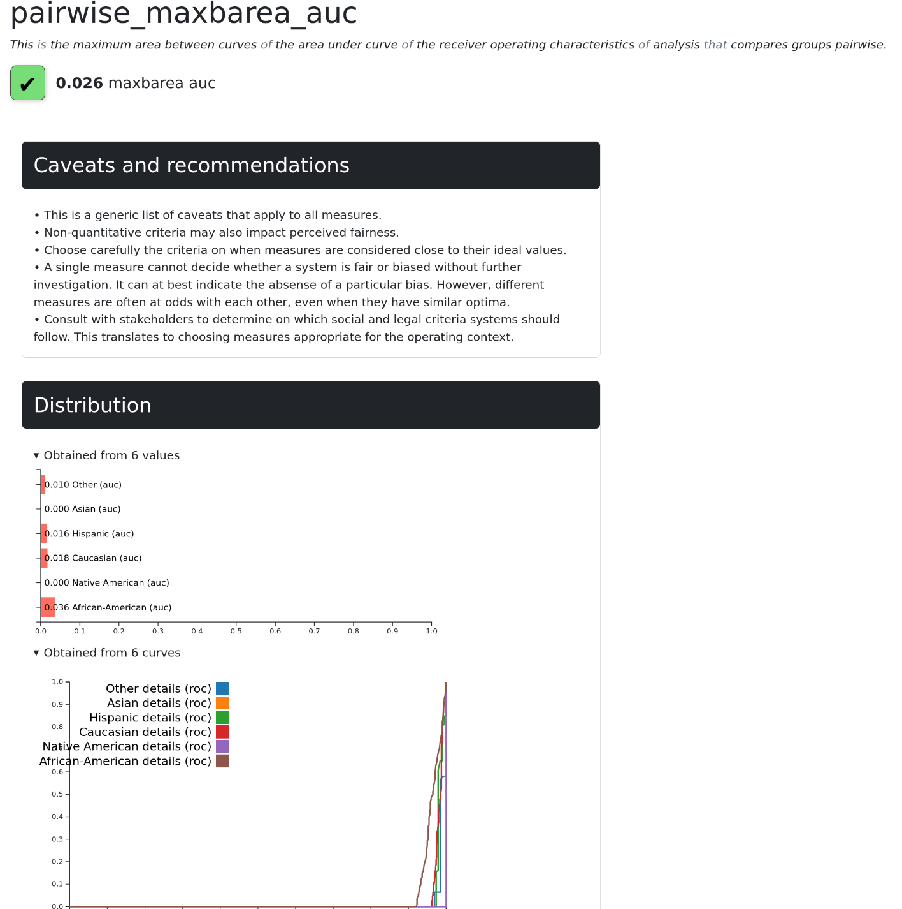

# Quickstart

Before starting, install FairBench with:

```shell
pip install --upgrade FairBench
```

This is only the lightweight version without any specifications,
which suffices for assessment of any system - install extras are
available to run out-of-the-box benchmarks for vision data or LLMs.
Here is a common workflow for computing a fairness measure.

!!! danger
    Although fairly common in research, computing one
    or only a few fairness measures is a common trap when assessing
    systems with real-world impact. 
    FairBench offers reports that cover a lot of scenarios to avoid this.

## 1. Prepare data

To assess your system, use it to generate predictions for test data.
Taking a break from most tutorials that focus on binary classification, 
we evaluate the recommendation capabilities
of a system obtained with from those available for out-of-the-box
experimentation, where
*yhat* hold prediction probabilities, *y* hold target binary labels,
and *x* is the test portion of the dataset.
This is not necessarily well-performing or fair.
Use the library to assess other types of predictive systems too. 
Supported data formats include lists, numpy arrays, 
and pytorch/tensorflow/jax tensors.

```python
import fairbench as fb
x, y, yhat = fb.bench.tabular.compas(test_size=0.5, predict="probabilities")
```

## 2. Sensitive attributes

Pack sensitive attributes found across test samples
into a data structure holding multiple [dimensions](documentation/dimensions.md).
This stores any number of attributes with any number of values
by considering each value as a separate dimension.

In particular, each dimension is a binary or fuzzy array
whose i-th element represents whether the i sample has the attribute
corresponding to the dimension. 
One construction pattern is the following The `@` operator is overloaded so that
methods that split data into small dictionaries can be called without 
making code less readable when there are many attributes.

```python
sensitive = fb.Dimensions(fb.categories @ x["race"])
```

!!! info
    For this quickstart we analyze only one attribute, but you can add
    more as positional arguments to *Dimensions*. The library also
    supports intersectionality by only transforming dimensions through
    appropriate methods. This is demonstrated in the next page.

## 3. Build & compute a measure

FairBench builds standardized fairness/bias measures from simpler building blocks, namely the type
of comparison between groups, the base assessment to be compared, 
and the reduction strategy to summarize all comparisons
to one value. Build a measure name by separating your choices 
with underscores (the order does not matter)
and access it from `fb.quick`; it is then dynamically generated or 
-if there was a mistake- available options will be explained.

The comparison between groups is either *pairwise* or *vsall* that compares each group
against the total population only. See measures and reductions [here](material/api.md).
Provide relevant to the base measure keyword among 
*predictions*, *scores*, *labels*, *order*, *target*, as described 
[here](documentation/reports.md), and the *sensitive* multidimensional attribute
presented above. 

Next is an example that shows how to compute the area between the curves contributing
to AUC computations, which is the area between ROC curves. This assesses the fairness
of recommender systems. A small value indicates that the curves are very similar between
groups even when considering the two most dissimilar. This measure is also known as 
*ABROCA* in the literature; extracting popular adhoc measures from reports
is done with filters. See more on the next page.

```python
abroca = fb.quick.pairwise_maxbarea_auc(scores=yhat, labels=y, sensitive=sensitive)
print(abroca.float())
```

```text
 0.024
```

!!! tip
    See the growing list of all supported measures by calling `fb.quick.help()`.
    This does not show invalid ones. For example, accuracy does not provide curves
    to compare. More than 300 measures can already be computed.


## 4. Go into details

In the above, we used `value.float()` to convert the computed value to a float number.
This is because the result is actually a full report that contains one element. 
This keeps track of intermediate computations and can be shown with 
various visualization environments.
Continue going through the documentation to learn more about reports and how to explore
them. For now, here is how you can see details about the computed value in your
browser. 


```python
abroca.show(env=fb.export.Html)
```




!!! info
    FairBench takes a responsible stance of reminding its users about
    caveats and recommendation to avoid extensive fairness epistemization.
    Looking at more values in the case of this example was
    sorely needed, because we did not have much area between curves 
    (had little bias) because our system was bad.

!!! danger
    The green checkmark helps visually indicate whether the 
    measure's value was big or small, but acceptable thresholds should 
    always rely on domain knowledge or stakeholder opinions. When many measures
    are computed, symbols and colors help you grasp at a glance which values 
    could be more problematic, which is what you would start scrutinizing first. 
    Strategies on applying your own thresholds are available 
    as report filters [here](material/filters.md).
    
Continue to an overview of how to automatically 
create and explore reports of many values by clicking on "Next".