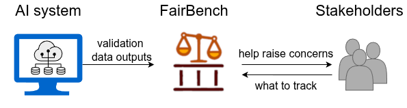

# Quickstart

Before starting, install FairBench with the following command.
This can assess any system. Install extras are
available to optionally run computer vision, graph, and LLMs benchmarks.

```shell
pip install --upgrade FairBench
```

The recommended workflow for identifying what to measure
starts by identifying prospective fairness concerns 
via [reports](reports.md). Then,
decide which of the concerns matter after drawing a broad enough
picture (human-in-the-loop, consult with stakeholders). Finally,
keep track of important concerns with standalone measures 
covered in this tutorial (jump to the end to see what results look like).



!!! danger
    Domain knowledge is often used to immediately select measures, 
    but we caution against that.

## 1. Prepare data

To assess your system, start by generating predictions for test data.
Here we evaluate a recommender system that is available for out-of-the-box
experimentation; outputs are the test portion of the dataset *x*, 
the target binary labels *y*, and positive prediction probabilities *yhat*.
We are interested in seeing how fair those probabilities are.

```python
import fairbench as fb
x, y, yhat = fb.bench.tabular.compas(test_size=0.5, predict="probabilities")
```

## 2. Sensitive attributes

Pack sensitive attributes found across test samples
into a data structure holding multiple sensitive 
[dimensions](documentation/dimensions.md). This structure stores any number 
of sensitive attributes with any number of values by 
considering each value as a separate dimension. Intersections
can also be obtained.

Each dimension is a binary or fuzzy (with truth values in [0,1]) array
whose i-th element represents whether the i data sample belongs in a
particular sensitive population group. For example, *white*, *black*,
*hispanic*, *asian*, etc could be sensitive groups for the sensitive
attribute "race" of this tutorial. 

One construction pattern for sensitive dimensions is the following:

```python
sensitive = fb.Dimensions(fb.categories@ x["race"])
print(sensitive)
```
<pre style="font-family:monospace;background:#222222;color:#c0c0c0;padding:1em;overflow-x:auto;font-size:12px">
Other                          [0 0 0 ... 0 0 0]
African-American               [1 1 1 ... 0 1 1]
Native American                [0 0 0 ... 0 0 0]
Asian                          [0 0 0 ... 0 0 0]
Caucasian                      [0 0 0 ... 0 0 0]
Hispanic                       [0 0 0 ... 1 0 0]
</pre>

!!! info
    The `fb.categories@` operator unpacks values into
    dictionaries. You can have multiple such dictionaries
    as positional arguments and even obtain their intersections. 
    See more in the documentation linked above.

## 3. Build & compute a measure

FairBench builds standardized fairness/bias measures from simpler 
building blocks. Three building blocks are combined;
build a standardized measure name by separating your choices 
with underscores (the order does not matter)
and access it from `fb.quick`. 

1. Which **measure** is considered favorable predictive outcomes for each group, such as high positive rate *pr* for hiring systems, high true positive rate *tpr* for criminal convictions, and accuracy *acc* for loan approvals.
2. The mechanism for determining which population groups to compare, namely where they should be compared *pairwise* or each group against the total population *vsall*.
3. The **reduction** strategy that summarizes all comparisons to one value, such as the minimum *min* across all groups, the maximum difference between groups *maxdiff*, and maximum relative difference *maxrel*.

**Example**: `fb.quick.pairwise_maxrel_acc` reads
as "the maximum relative accuracy difference when comparing
groups pairwise". Basically, it would compute the accuracy 
for each group, get the relative difference between all group
accuracies (e.g. 0.4 and 0.5 accuracies have relative difference 
of 0.1/max(0.4,0.5)=0.2), and report the maximum of those
differences.


!!! info
    See a comprehensive list of all 
    [measures and reductions](material/api.md).
    If the measure name is invalid, available options will be explained.

To call the constructed measure, provide
[relevant keywords](documentation/reports.md) among 
*predictions*, *multipredictions*, *scores*, 
*labels*, *multilabels*, *order*, *target*, and the *sensitive* 
dimensions construct above.
For instance, we next compare the surface area 
between the ROC curves involved in AUC computations
(curves can be retrieved from measure values 
because FairBench tracks all intermediate
computations). Curve comparison assesses the fairness
of recommender systems, where a small area difference 
indicates that the curves are similar between groups.
This bias measure is also known as *ABROCA* in the literature, 
but FairBench standardizes the naming scheme of measures.

```python
abroca = fb.quick.pairwise_maxbarea_auc(scores=yhat, labels=y, sensitive=sensitive)
print(abroca.float())
```

```text
 0.024
```

Print FairBench's growing list of more than 300 valid measures like so.
Use [reports](reports.md) to quickly compute and organize all applicable 
measures.

```python
fb.quick.help()
```

<pre style="font-family:monospace;background:#222222;color:#c0c0c0;padding:1em;overflow-x:auto;font-size:12px;max-height: 200px;overflow-y:auto">
Showing all fairness measures that can be computed.
These are dynamically created from building blocks.
Create reports to capture many of those.

fairbench.quick.pairwise_min_acc
fairbench.quick.pairwise_min_pr
fairbench.quick.pairwise_min_tpr
fairbench.quick.pairwise_min_tnr
fairbench.quick.pairwise_min_ppv
fairbench.quick.pairwise_min_f1
fairbench.quick.pairwise_min_gmi
fairbench.quick.pairwise_min_tar
fairbench.quick.pairwise_min_trr
fairbench.quick.pairwise_min_lift
fairbench.quick.pairwise_min_mcc
fairbench.quick.pairwise_min_kappa
fairbench.quick.pairwise_min_avgscore
fairbench.quick.pairwise_min_auc
fairbench.quick.pairwise_min_ndcg
fairbench.quick.pairwise_min_topndcg
fairbench.quick.pairwise_min_tophr
fairbench.quick.pairwise_min_toprec
fairbench.quick.pairwise_min_topf1
fairbench.quick.pairwise_min_nmrr
fairbench.quick.pairwise_min_nentropy
fairbench.quick.pairwise_min_r2
fairbench.quick.pairwise_min_spearman
fairbench.quick.pairwise_min_rbo
fairbench.quick.pairwise_max_pr
fairbench.quick.pairwise_max_tar
fairbench.quick.pairwise_max_trr
fairbench.quick.pairwise_max_lift
fairbench.quick.pairwise_max_avgscore
fairbench.quick.pairwise_max_ndcg
fairbench.quick.pairwise_max_topndcg
fairbench.quick.pairwise_max_tophr
fairbench.quick.pairwise_max_toprec
fairbench.quick.pairwise_max_topf1
fairbench.quick.pairwise_max_nmrr
fairbench.quick.pairwise_max_nentropy
fairbench.quick.pairwise_max_mabs
fairbench.quick.pairwise_max_rmse
fairbench.quick.pairwise_max_pinball
fairbench.quick.pairwise_max_ndrl
fairbench.quick.pairwise_maxerror_acc
fairbench.quick.pairwise_maxerror_tpr
fairbench.quick.pairwise_maxerror_tnr
fairbench.quick.pairwise_maxerror_ppv
fairbench.quick.pairwise_maxerror_f1
fairbench.quick.pairwise_maxerror_gmi
fairbench.quick.pairwise_maxerror_mcc
fairbench.quick.pairwise_maxerror_kappa
fairbench.quick.pairwise_maxerror_auc
fairbench.quick.pairwise_maxerror_mabs
fairbench.quick.pairwise_maxerror_rmse
fairbench.quick.pairwise_maxerror_r2
fairbench.quick.pairwise_maxerror_pinball
fairbench.quick.pairwise_maxerror_spearman
fairbench.quick.pairwise_maxerror_rbo
fairbench.quick.pairwise_maxerror_ndrl
fairbench.quick.pairwise_wmean_acc
fairbench.quick.pairwise_wmean_pr
fairbench.quick.pairwise_wmean_tpr
fairbench.quick.pairwise_wmean_tnr
fairbench.quick.pairwise_wmean_ppv
fairbench.quick.pairwise_wmean_tar
fairbench.quick.pairwise_wmean_trr
fairbench.quick.pairwise_wmean_lift
fairbench.quick.pairwise_wmean_kappa
fairbench.quick.pairwise_wmean_avgscore
fairbench.quick.pairwise_wmean_auc
fairbench.quick.pairwise_wmean_ndcg
fairbench.quick.pairwise_wmean_topndcg
fairbench.quick.pairwise_wmean_tophr
fairbench.quick.pairwise_wmean_toprec
fairbench.quick.pairwise_wmean_topf1
fairbench.quick.pairwise_wmean_nmrr
fairbench.quick.pairwise_wmean_nentropy
fairbench.quick.pairwise_wmean_mabs
fairbench.quick.pairwise_wmean_rmse
fairbench.quick.pairwise_wmean_r2
fairbench.quick.pairwise_wmean_pinball
fairbench.quick.pairwise_wmean_spearman
fairbench.quick.pairwise_wmean_rbo
fairbench.quick.pairwise_wmean_ndrl
fairbench.quick.pairwise_mean_acc
fairbench.quick.pairwise_mean_pr
fairbench.quick.pairwise_mean_tpr
fairbench.quick.pairwise_mean_tnr
fairbench.quick.pairwise_mean_ppv
fairbench.quick.pairwise_mean_f1
fairbench.quick.pairwise_mean_gmi
fairbench.quick.pairwise_mean_tar
fairbench.quick.pairwise_mean_trr
fairbench.quick.pairwise_mean_lift
fairbench.quick.pairwise_mean_mcc
fairbench.quick.pairwise_mean_kappa
fairbench.quick.pairwise_mean_avgscore
fairbench.quick.pairwise_mean_auc
fairbench.quick.pairwise_mean_ndcg
fairbench.quick.pairwise_mean_topndcg
fairbench.quick.pairwise_mean_tophr
fairbench.quick.pairwise_mean_toprec
fairbench.quick.pairwise_mean_topf1
fairbench.quick.pairwise_mean_nmrr
fairbench.quick.pairwise_mean_nentropy
fairbench.quick.pairwise_mean_mabs
fairbench.quick.pairwise_mean_rmse
fairbench.quick.pairwise_mean_r2
fairbench.quick.pairwise_mean_pinball
fairbench.quick.pairwise_mean_spearman
fairbench.quick.pairwise_mean_rbo
fairbench.quick.pairwise_mean_ndrl
fairbench.quick.pairwise_gm_acc
fairbench.quick.pairwise_gm_pr
fairbench.quick.pairwise_gm_tpr
fairbench.quick.pairwise_gm_tnr
fairbench.quick.pairwise_gm_ppv
fairbench.quick.pairwise_gm_f1
fairbench.quick.pairwise_gm_gmi
fairbench.quick.pairwise_gm_tar
fairbench.quick.pairwise_gm_trr
fairbench.quick.pairwise_gm_lift
fairbench.quick.pairwise_gm_avgscore
fairbench.quick.pairwise_gm_auc
fairbench.quick.pairwise_gm_ndcg
fairbench.quick.pairwise_gm_topndcg
fairbench.quick.pairwise_gm_tophr
fairbench.quick.pairwise_gm_toprec
fairbench.quick.pairwise_gm_topf1
fairbench.quick.pairwise_gm_nmrr
fairbench.quick.pairwise_gm_nentropy
fairbench.quick.pairwise_gm_mabs
fairbench.quick.pairwise_gm_rmse
fairbench.quick.pairwise_gm_pinball
fairbench.quick.pairwise_gm_spearman
fairbench.quick.pairwise_gm_rbo
fairbench.quick.pairwise_gm_ndrl
fairbench.quick.pairwise_pnorm_acc
fairbench.quick.pairwise_pnorm_pr
fairbench.quick.pairwise_pnorm_tpr
fairbench.quick.pairwise_pnorm_tnr
fairbench.quick.pairwise_pnorm_ppv
fairbench.quick.pairwise_pnorm_f1
fairbench.quick.pairwise_pnorm_gmi
fairbench.quick.pairwise_pnorm_tar
fairbench.quick.pairwise_pnorm_trr
fairbench.quick.pairwise_pnorm_lift
fairbench.quick.pairwise_pnorm_mcc
fairbench.quick.pairwise_pnorm_kappa
fairbench.quick.pairwise_pnorm_avgscore
fairbench.quick.pairwise_pnorm_auc
fairbench.quick.pairwise_pnorm_ndcg
fairbench.quick.pairwise_pnorm_topndcg
fairbench.quick.pairwise_pnorm_tophr
fairbench.quick.pairwise_pnorm_toprec
fairbench.quick.pairwise_pnorm_topf1
fairbench.quick.pairwise_pnorm_nmrr
fairbench.quick.pairwise_pnorm_nentropy
fairbench.quick.pairwise_pnorm_mabs
fairbench.quick.pairwise_pnorm_rmse
fairbench.quick.pairwise_pnorm_r2
fairbench.quick.pairwise_pnorm_pinball
fairbench.quick.pairwise_pnorm_spearman
fairbench.quick.pairwise_pnorm_rbo
fairbench.quick.pairwise_pnorm_ndrl
fairbench.quick.pairwise_maxbarea_avgscore
fairbench.quick.pairwise_maxbarea_auc
fairbench.quick.pairwise_maxbarea_nentropy
fairbench.quick.pairwise_maxbarea_ndrl
fairbench.quick.pairwise_maxrel_acc
fairbench.quick.pairwise_maxrel_pr
fairbench.quick.pairwise_maxrel_tpr
fairbench.quick.pairwise_maxrel_tnr
fairbench.quick.pairwise_maxrel_ppv
fairbench.quick.pairwise_maxrel_f1
fairbench.quick.pairwise_maxrel_gmi
fairbench.quick.pairwise_maxrel_tar
fairbench.quick.pairwise_maxrel_trr
fairbench.quick.pairwise_maxrel_lift
fairbench.quick.pairwise_maxrel_mcc
fairbench.quick.pairwise_maxrel_kappa
fairbench.quick.pairwise_maxrel_avgscore
fairbench.quick.pairwise_maxrel_auc
fairbench.quick.pairwise_maxrel_ndcg
fairbench.quick.pairwise_maxrel_topndcg
fairbench.quick.pairwise_maxrel_tophr
fairbench.quick.pairwise_maxrel_toprec
fairbench.quick.pairwise_maxrel_topf1
fairbench.quick.pairwise_maxrel_nmrr
fairbench.quick.pairwise_maxrel_nentropy
fairbench.quick.pairwise_maxrel_mabs
fairbench.quick.pairwise_maxrel_rmse
fairbench.quick.pairwise_maxrel_r2
fairbench.quick.pairwise_maxrel_pinball
fairbench.quick.pairwise_maxrel_spearman
fairbench.quick.pairwise_maxrel_rbo
fairbench.quick.pairwise_maxrel_ndrl
fairbench.quick.pairwise_maxdiff_acc
fairbench.quick.pairwise_maxdiff_pr
fairbench.quick.pairwise_maxdiff_tpr
fairbench.quick.pairwise_maxdiff_tnr
fairbench.quick.pairwise_maxdiff_ppv
fairbench.quick.pairwise_maxdiff_f1
fairbench.quick.pairwise_maxdiff_gmi
fairbench.quick.pairwise_maxdiff_tar
fairbench.quick.pairwise_maxdiff_trr
fairbench.quick.pairwise_maxdiff_lift
fairbench.quick.pairwise_maxdiff_mcc
fairbench.quick.pairwise_maxdiff_kappa
fairbench.quick.pairwise_maxdiff_avgscore
fairbench.quick.pairwise_maxdiff_auc
fairbench.quick.pairwise_maxdiff_ndcg
fairbench.quick.pairwise_maxdiff_topndcg
fairbench.quick.pairwise_maxdiff_tophr
fairbench.quick.pairwise_maxdiff_toprec
fairbench.quick.pairwise_maxdiff_topf1
fairbench.quick.pairwise_maxdiff_nmrr
fairbench.quick.pairwise_maxdiff_nentropy
fairbench.quick.pairwise_maxdiff_mabs
fairbench.quick.pairwise_maxdiff_rmse
fairbench.quick.pairwise_maxdiff_r2
fairbench.quick.pairwise_maxdiff_pinball
fairbench.quick.pairwise_maxdiff_spearman
fairbench.quick.pairwise_maxdiff_rbo
fairbench.quick.pairwise_maxdiff_ndrl
fairbench.quick.pairwise_gini_acc
fairbench.quick.pairwise_gini_pr
fairbench.quick.pairwise_gini_tpr
fairbench.quick.pairwise_gini_tnr
fairbench.quick.pairwise_gini_ppv
fairbench.quick.pairwise_gini_f1
fairbench.quick.pairwise_gini_gmi
fairbench.quick.pairwise_gini_tar
fairbench.quick.pairwise_gini_trr
fairbench.quick.pairwise_gini_lift
fairbench.quick.pairwise_gini_mcc
fairbench.quick.pairwise_gini_kappa
fairbench.quick.pairwise_gini_avgscore
fairbench.quick.pairwise_gini_auc
fairbench.quick.pairwise_gini_ndcg
fairbench.quick.pairwise_gini_topndcg
fairbench.quick.pairwise_gini_tophr
fairbench.quick.pairwise_gini_toprec
fairbench.quick.pairwise_gini_topf1
fairbench.quick.pairwise_gini_nmrr
fairbench.quick.pairwise_gini_nentropy
fairbench.quick.pairwise_gini_mabs
fairbench.quick.pairwise_gini_rmse
fairbench.quick.pairwise_gini_r2
fairbench.quick.pairwise_gini_pinball
fairbench.quick.pairwise_gini_spearman
fairbench.quick.pairwise_gini_rbo
fairbench.quick.pairwise_gini_ndrl
fairbench.quick.pairwise_stdx2_acc
fairbench.quick.pairwise_stdx2_pr
fairbench.quick.pairwise_stdx2_tpr
fairbench.quick.pairwise_stdx2_tnr
fairbench.quick.pairwise_stdx2_ppv
fairbench.quick.pairwise_stdx2_f1
fairbench.quick.pairwise_stdx2_gmi
fairbench.quick.pairwise_stdx2_tar
fairbench.quick.pairwise_stdx2_trr
fairbench.quick.pairwise_stdx2_lift
fairbench.quick.pairwise_stdx2_mcc
fairbench.quick.pairwise_stdx2_kappa
fairbench.quick.pairwise_stdx2_avgscore
fairbench.quick.pairwise_stdx2_auc
fairbench.quick.pairwise_stdx2_ndcg
fairbench.quick.pairwise_stdx2_topndcg
fairbench.quick.pairwise_stdx2_tophr
fairbench.quick.pairwise_stdx2_toprec
fairbench.quick.pairwise_stdx2_topf1
fairbench.quick.pairwise_stdx2_nmrr
fairbench.quick.pairwise_stdx2_nentropy
fairbench.quick.pairwise_stdx2_mabs
fairbench.quick.pairwise_stdx2_rmse
fairbench.quick.pairwise_stdx2_r2
fairbench.quick.pairwise_stdx2_pinball
fairbench.quick.pairwise_stdx2_spearman
fairbench.quick.pairwise_stdx2_rbo
fairbench.quick.pairwise_stdx2_ndrl
fairbench.quick.vsall_min_acc
fairbench.quick.vsall_min_pr
fairbench.quick.vsall_min_tpr
fairbench.quick.vsall_min_tnr
fairbench.quick.vsall_min_ppv
fairbench.quick.vsall_min_f1
fairbench.quick.vsall_min_gmi
fairbench.quick.vsall_min_tar
fairbench.quick.vsall_min_trr
fairbench.quick.vsall_min_lift
fairbench.quick.vsall_min_mcc
fairbench.quick.vsall_min_kappa
fairbench.quick.vsall_min_avgscore
fairbench.quick.vsall_min_auc
fairbench.quick.vsall_min_ndcg
fairbench.quick.vsall_min_topndcg
fairbench.quick.vsall_min_tophr
fairbench.quick.vsall_min_toprec
fairbench.quick.vsall_min_topf1
fairbench.quick.vsall_min_nmrr
fairbench.quick.vsall_min_nentropy
fairbench.quick.vsall_min_r2
fairbench.quick.vsall_min_spearman
fairbench.quick.vsall_min_rbo
fairbench.quick.vsall_max_pr
fairbench.quick.vsall_max_tar
fairbench.quick.vsall_max_trr
fairbench.quick.vsall_max_lift
fairbench.quick.vsall_max_avgscore
fairbench.quick.vsall_max_ndcg
fairbench.quick.vsall_max_topndcg
fairbench.quick.vsall_max_tophr
fairbench.quick.vsall_max_toprec
fairbench.quick.vsall_max_topf1
fairbench.quick.vsall_max_nmrr
fairbench.quick.vsall_max_nentropy
fairbench.quick.vsall_max_mabs
fairbench.quick.vsall_max_rmse
fairbench.quick.vsall_max_pinball
fairbench.quick.vsall_max_ndrl
fairbench.quick.vsall_largestmaxrel_acc
fairbench.quick.vsall_largestmaxrel_pr
fairbench.quick.vsall_largestmaxrel_tpr
fairbench.quick.vsall_largestmaxrel_tnr
fairbench.quick.vsall_largestmaxrel_ppv
fairbench.quick.vsall_largestmaxrel_tar
fairbench.quick.vsall_largestmaxrel_trr
fairbench.quick.vsall_largestmaxrel_lift
fairbench.quick.vsall_largestmaxrel_kappa
fairbench.quick.vsall_largestmaxrel_avgscore
fairbench.quick.vsall_largestmaxrel_auc
fairbench.quick.vsall_largestmaxrel_ndcg
fairbench.quick.vsall_largestmaxrel_topndcg
fairbench.quick.vsall_largestmaxrel_tophr
fairbench.quick.vsall_largestmaxrel_toprec
fairbench.quick.vsall_largestmaxrel_topf1
fairbench.quick.vsall_largestmaxrel_nmrr
fairbench.quick.vsall_largestmaxrel_nentropy
fairbench.quick.vsall_largestmaxrel_mabs
fairbench.quick.vsall_largestmaxrel_rmse
fairbench.quick.vsall_largestmaxrel_r2
fairbench.quick.vsall_largestmaxrel_pinball
fairbench.quick.vsall_largestmaxrel_spearman
fairbench.quick.vsall_largestmaxrel_rbo
fairbench.quick.vsall_largestmaxrel_ndrl
fairbench.quick.vsall_largestmaxdiff_acc
fairbench.quick.vsall_largestmaxdiff_pr
fairbench.quick.vsall_largestmaxdiff_tpr
fairbench.quick.vsall_largestmaxdiff_tnr
fairbench.quick.vsall_largestmaxdiff_ppv
fairbench.quick.vsall_largestmaxdiff_f1
fairbench.quick.vsall_largestmaxdiff_gmi
fairbench.quick.vsall_largestmaxdiff_tar
fairbench.quick.vsall_largestmaxdiff_trr
fairbench.quick.vsall_largestmaxdiff_lift
fairbench.quick.vsall_largestmaxdiff_mcc
fairbench.quick.vsall_largestmaxdiff_kappa
fairbench.quick.vsall_largestmaxdiff_avgscore
fairbench.quick.vsall_largestmaxdiff_auc
fairbench.quick.vsall_largestmaxdiff_ndcg
fairbench.quick.vsall_largestmaxdiff_topndcg
fairbench.quick.vsall_largestmaxdiff_tophr
fairbench.quick.vsall_largestmaxdiff_toprec
fairbench.quick.vsall_largestmaxdiff_topf1
fairbench.quick.vsall_largestmaxdiff_nmrr
fairbench.quick.vsall_largestmaxdiff_nentropy
fairbench.quick.vsall_largestmaxdiff_mabs
fairbench.quick.vsall_largestmaxdiff_rmse
fairbench.quick.vsall_largestmaxdiff_r2
fairbench.quick.vsall_largestmaxdiff_pinball
fairbench.quick.vsall_largestmaxdiff_spearman
fairbench.quick.vsall_largestmaxdiff_rbo
fairbench.quick.vsall_largestmaxdiff_ndrl
fairbench.quick.vsall_largestmaxbarea_avgscore
fairbench.quick.vsall_largestmaxbarea_auc
fairbench.quick.vsall_largestmaxbarea_nentropy
fairbench.quick.vsall_largestmaxbarea_ndrl
</pre>


## 4. Go into details

In the above, we used `value.float()` to convert the computed value to a float number.
However, the result is actually a [report](reports.md) of one element. 
Reports track intermediate computations -and even some qualitative characteristics-
and can be visualized through various means.
For now, here is how to see details about the computed value in your
browser. 


```python
abroca.show(env=fb.export.Html)
```

The following page opens in the browser, 
and you can explore it here too. 
The green checkmark indicates that the 
measure's value was "small". Find
how to apply your own thresholds 
in [report filters](material/filters.md).

Furthermore, the investigated
system seems fair enough, but can you check if it is
actually well-performing? Because random noise may
be fair but not necessarily practically useful.
*Hint: Expand the 
dropdowns at the end of the preview to see
per-group AUC values and ROC curves.*

<iframe
  src="/preview_abroca.html"
  style="border: 1px solid black; width: 144%;height: 700px;border: none;margin-bottom:-100px;transform:scale(0.7);transform-origin: top left;overflow: auto"
></iframe>

