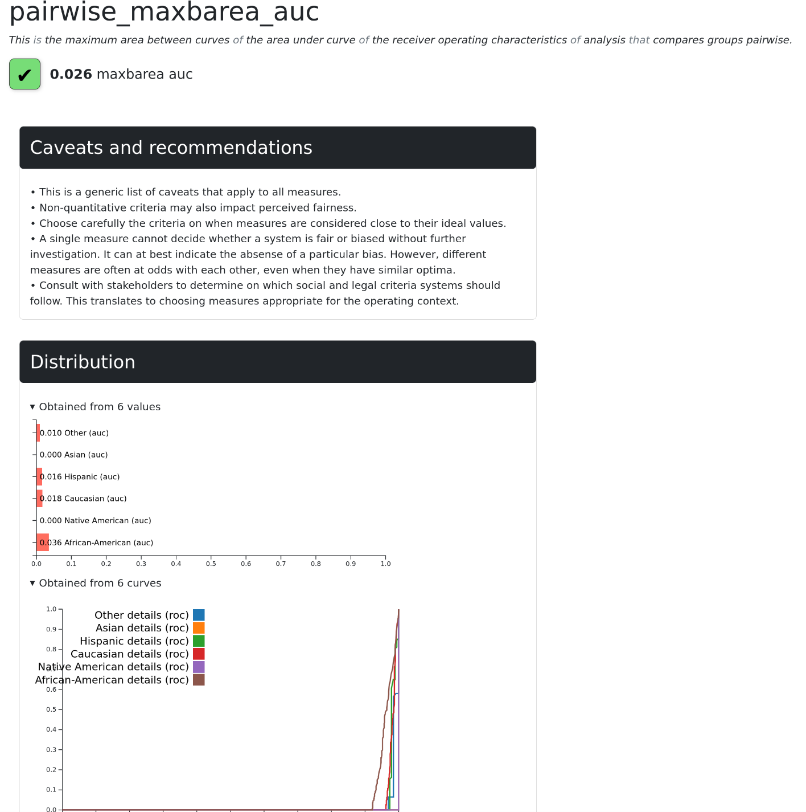

# Quickstart

Before starting, install FairBench with:

```shell
pip install --upgrade FairBench
```

This can assess any system. Install extras are
available to also run computer vision, graph, and LLMs benchmarks.
This tutorial shows a common workflow for computing one fairness measure.

!!! info
    FairBench offers [reports](reports.md) for covering tens to
    hundreds of such measures. If you do not know which measure you
    want, try to explore your system with such reports first.

## 1. Prepare data

To assess your system, start by generating predictions for test data.
Here we evaluate a recommender system that is available for out-of-the-box
experimentation; outputs are the test portion of the dataset *x*, 
the target binary labels *y*, and positive prediction probabilities *yhat*.
We are interested in seeing how fair those probabilities are.

```python
import fairbench as fb
x, y, yhat = fb.bench.tabular.compas(test_size=0.5, predict="probabilities")
```

!!! info
    FairBench also supports other types of predictive tasks too, such as 
    (multiclass) classification and ranking. Supported data formats
    for system outputs include include lists or other iterables, 
    numpy arrays, and pytorch/tensorflow/jax tensors.

## 2. Sensitive attributes

Pack sensitive attributes found across test samples
into a data structure holding multiple sensitive 
[dimensions](documentation/dimensions.md). This structure stores any number 
of sensitive attributes with any number of values by 
considering each value as a separate dimension. Intersections
can also be obtained.

Each dimension is a binary or fuzzy (with truth values in [0,1]) array
whose i-th element represents whether the i data sample belongs in a
particular sensitive population group. For example, *white*, *black*,
*hispanic*, *asian*, etc could be sensitive groups for the sensitive
attribute "race" of this tutorial. 

One construction pattern for sensitive dimensions is the following:

```python
sensitive = fb.Dimensions(fb.categories@ x["race"])
```

!!! info
    The `fb.categories@` operator unpacks values into
    dictionaries). You can have multiple such dictionaries
    as positional arguments and even obtain their intersections. 
    See more in the documentation linked above.

## 3. Build & compute a measure

FairBench builds standardized fairness/bias measures from simpler 
building blocks. Three building blocks are combined:
1. Which **measure** is considered favorable predictive outcomes for each group, such as high positive rate `pr` for hiring systems, high true positive rate `tpr` for criminal convictions, and`accuracy` for loan approvals.
2. The mechanism for determining which population groups to compare, namely where they should be compared `pairwise` or each group against the total population `vsall`.
3. The **reduction** strategy that summarizes all comparisons to one value, such as the minimum `min` across all groups, the maximum difference between groups `maxdiff`, and maximum relative difference `maxrel`.

Build a measure name by separating your choices 
with underscores (the order does not matter)
and access it from `fb.quick`. Here is an example of
a measure function: `fb.quick.pairwise_maxrel_acc`. Read this
as "the maximum relative accuracy difference when comparing
groups pairwise". Basically, it would compute the accuracy 
for each group, get the relative difference between all group
accuracies (e.g. 0.4 and 0.5 accuracies have relative difference 
of `0.1/max(0.4,0.5)=0.2`) and reports the maximum of those
differences.

See the comprehensive list of all 
[measures and reductions](material/api.md).
If the measure name is invalid, available options will be explained.

To call the constructed measure, provide 
relevant to the base measure keyword among 
*predictions*, *multipredictions*, *scores*, 
*labels*, *multilabels*, *order*, *target*, as described 
[here](documentation/reports.md), and the *sensitive* 
dimensions construct above. 

Next is an example that shows how to compute the surface area 
between the ROC curves of AUC computations. This assesses the fairness
of recommender systems. A small area indicates that the 
curves are very similar between groups even when considering 
the two most dissimilar. 

```python
abroca = fb.quick.pairwise_maxbarea_auc(scores=yhat, labels=y, sensitive=sensitive)
print(abroca.float())
```

```text
 0.024
```

!!! info
    This measure is also known as *ABROCA* in the literature, but FairBench standardizes their naming scheme.
    See the growing list of more than 300 valid buildable measures by calling `fb.quick.help()`.


## 4. Go into details

In the above, we used `value.float()` to convert the computed value to a float number.
However, the result is actually a [report](reports.md) of one element. 
Reports track intermediate computations -and even some qualitative characteristics-
and can be visualized through various means.
For now, here is how to see details about the computed value in your
browser. 


```python
abroca.show(env=fb.export.Html)
```



!!! danger
    The green checkmark indicates whether the 
    measure's value was big or small, but acceptable thresholds should 
    always rely on domain knowledge or stakeholder opinions. 
    How to applying your own thresholds is described in 
    [report filters](material/filters.md).
